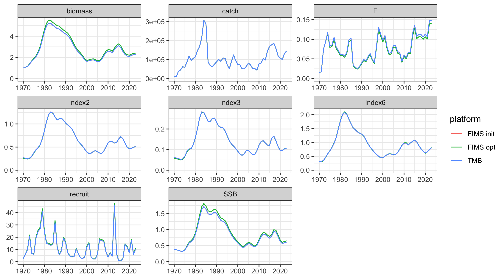
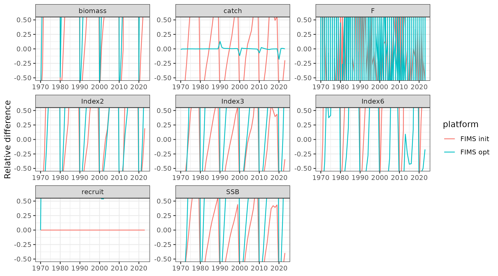
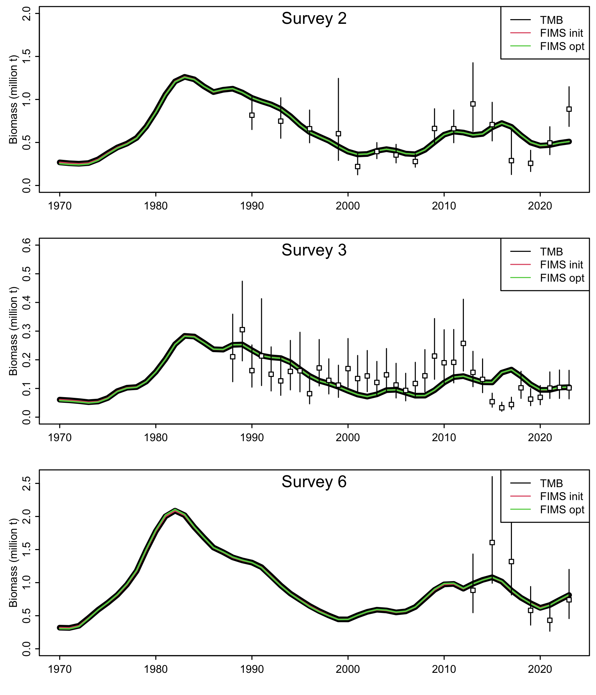
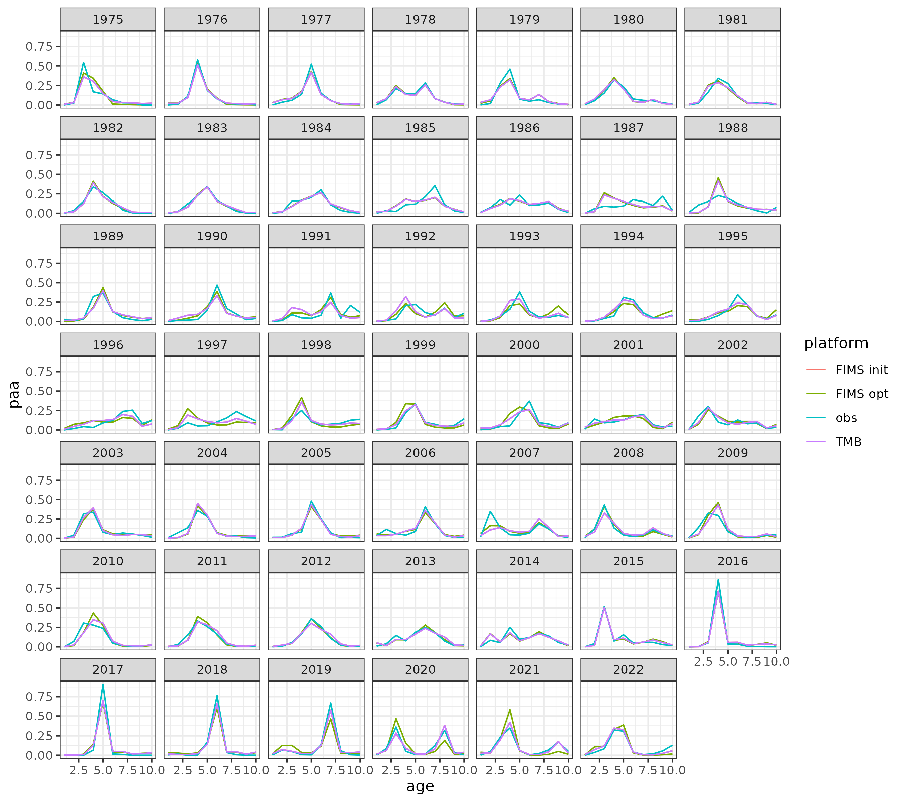
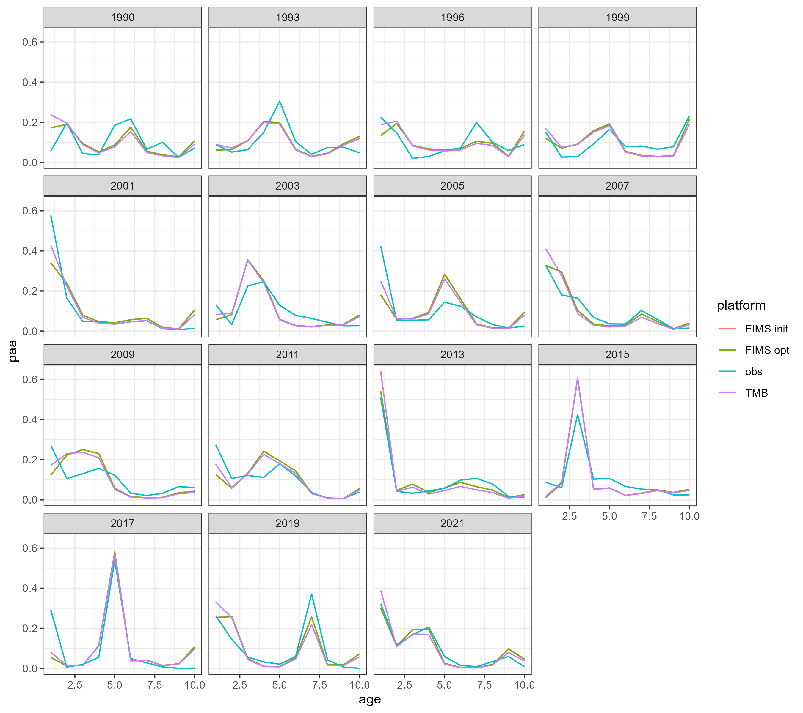

## The setup



```{r}
#| label: setup-objects
common_name <- "Gulf of Alaska walleye pollock"

# define the dimensions and global variables
years <- 1970:2023
n_years <- length(years)
ages <- 1:10
n_ages <- length(ages)
```

* R version: `r R_version`
* TMB version: `r TMB_version`
* FIMS commit: `r FIMS_commit`
* Stock name: `r common_name`
* Region: AFSC
* Analyst: Cole Monnahan

## Simplifications to the original assessment

The model presented in this case study was changed substantially from the operational version and should not be considered reflective of the `r common_name` stock. These results are intended to be a demonstration and nothing more.

To get the operational model to more closely match a FIMS model the following changes were made:

* Dropped surveys 1, 4, and 5
* Removed ageing error
* Removed length compositions
* Removed bias correction in log-normal index likelihoods
* Simplified catchability of survey 3 to be constant in time (removed random walk)
* Updated maturity to be parametric rather than empirical
* Used constant weight at age for all sources: spawning, fishery, surveys, and biomass calculations. The same matrix was used throughout.
* Change timing to be Jan 1 for spawning and all surveys
* Removed prior on catchability for survey 2
* Removed time-varying fisheries selectivity (constant double logistic)
* Took off normalization of selectivity
* Removed age accumulation for fishery age compositions

## Setting up the data

```{r}
#| label: prepare-fims-data
#| output: false
#| warning: false

#
## This will fit the models bridging to FIMS (simplifying)
## source("fit_bridge_models.R")
## compare changes to model
pkfitfinal <- readRDS(file.path(data_directory, "pkfitfinal.RDS"))
pkfit0 <- readRDS(file.path(data_directory, "pkfit0.RDS"))
rep0 <- pkfitfinal$rep
parfinal <- pkfitfinal$obj$env$parList()
pkinput0 <- readRDS(file.path(data_directory, "pkinput0.RDS"))
fimsdat <- pkdat0 <- pkinput0$dat
pkinput <- readRDS(file.path(data_directory, "pkinput.RDS"))
data_4_model <- prepare_pollock_data(
  pkfitfinal = pkfitfinal,
  pkfit0 = pkfit0,
  parfinal = parfinal,
  fimsdat = fimsdat,
  pkinput = pkinput,
  years = years,
  n_years = n_years,
  ages = ages,
  n_ages = n_ages
)
```

## Run FIMS model

```{r}
#| label: setup-model
FIMS::clear()

estimate_fish_selex <- TRUE
estimate_survey_selex <- TRUE
estimate_q2 <- TRUE
estimate_q3 <- TRUE
estimate_q6 <- TRUE
estimate_F <- TRUE
estimate_recdevs <- TRUE

# Create parameters list and update default values for parameters
default_parameters <- FIMS::create_default_configurations(
  data = data_4_model
) |>
  tidyr::unnest(cols = data) |>
  dplyr::rows_update(
    tibble::tibble(
      module_name = "Selectivity",
      fleet_name = c("fleet1", "survey2", "survey6"),
      module_type = "DoubleLogistic"
    ),
    by = c("module_name", "fleet_name")
  ) |>
  FIMS::create_default_parameters(
    data = data_4_model
  ) |>
  tidyr::unnest(cols = data) |>
  dplyr::rows_update(
    tibble::tibble(
      module_name = "Selectivity",
      fleet_name = "fleet1",
      label = c(
        "inflection_point_asc", "slope_asc",
        "inflection_point_desc", "slope_desc"
      ),
      value = c(
        parfinal$inf1_fsh_mean,
        exp(parfinal$log_slp1_fsh_mean),
        parfinal$inf2_fsh_mean,
        exp(parfinal$log_slp2_fsh_mean)
      ),
      estimation_type = "fixed_effects"
    ),
    by = c("module_name", "fleet_name", "label")
  ) |>
  dplyr::rows_update(
    tibble::tibble(
      module_name = "Selectivity",
      fleet_name = "survey2",
      label = c(
        "inflection_point_asc", "slope_asc",
        "inflection_point_desc", "slope_desc"
      ),
      value = c(
        parfinal$inf1_srv2,
        exp(parfinal$log_slp1_srv2),
        parfinal$inf2_srv2,
        exp(parfinal$log_slp2_srv2)
      ),
      estimation_type = rep(c("fixed_effects", "constant"), each = 2)
    ),
    by = c("module_name", "fleet_name", "label")
  ) |>
  dplyr::rows_update(
    tibble::tibble(
      module_name = "Selectivity",
      fleet_name = "survey6",
      label = c(
        "inflection_point_asc", "slope_asc",
        "inflection_point_desc", "slope_desc"
      ),
      value = c(
        parfinal$inf1_srv6,
        exp(parfinal$log_slp1_srv6),
        parfinal$inf2_srv6,
        exp(parfinal$log_slp2_srv6)
      ),
      estimation_type = rep(c("constant", "fixed_effects"), each = 2)
    ),
    by = c("module_name", "fleet_name", "label")
  ) |>
  dplyr::rows_update(
    tibble::tibble(
      module_name = "Selectivity",
      fleet_name = "survey3",
      label = c("inflection_point", "slope"),
      value = c(
        parfinal$inf1_srv3,
        exp(parfinal$log_slp1_srv3)
      )
    ),
    by = c("module_name", "fleet_name", "label")
  ) |>
  dplyr::rows_update(
    tibble::tibble(
      module_name = "Maturity",
      label = c("inflection_point", "slope"),
      value = c(4.5, 1.5)
    ),
    by = c("module_name", "label")
  ) |>
  dplyr::rows_update(
    tibble::tibble(
      module_name = "Recruitment",
      label = c(
        "log_rzero",
        "logit_steep",
        "log_sd"
      ),
      value = c(
        parfinal$mean_log_recruit + log(1e9),
        FIMS::logit(0.2, 1.0, 0.99999),
        parfinal$sigmaR
      )
    ),
    by = c("module_name", "label")
  ) |>
  dplyr::rows_update(
    tibble::tibble(
      module_name = "Population",
      label = c("log_init_naa"),
      age = ages,
      value = c(log(pkfitfinal$rep$recruit[1]), log(pkfitfinal$rep$initN)) + log(1e9),
      estimation_type = "constant"
    ),
    by = c("module_name", "age", "label")
  ) |>
  dplyr::rows_update(
    tibble::tibble(
      module_name = "Population",
      time = rep(years, each = FIMS::get_n_ages(data_4_model)),
      age = rep(ages, FIMS::get_n_years(data_4_model)),
      label = "log_M",
      value = log(as.numeric(t(matrix(
        rep(pkfitfinal$rep$M, each = FIMS::get_n_years(data_4_model)),
        nrow = FIMS::get_n_years(data_4_model)
      ))))
    ),
    by = c("module_name", "label", "time", "age")
  ) |>
  dplyr::rows_update(
    tibble::tibble(
      module_name = "Recruitment",
      label = "log_devs",
      time = years[-1],
      # The last value of the initial numbers at age is the first
      # recruitment deviation
      value = parfinal$dev_log_recruit[-1],
    ),
    by = c("module_name", "label", "time")
  ) |>
  dplyr::rows_update(
    tibble::tibble(
      module_name = "Fleet",
      fleet_name = "fleet1",
      time = years,
      label = "log_Fmort",
      value = log(pkfitfinal$rep$F)
    ),
    by = c("module_name", "fleet_name", "label", "time")
  ) |>
  dplyr::rows_update(
    tibble::tibble(
      module_name = "Fleet",
      fleet_name = c("survey2", "survey3", "survey6"),
      label = "log_q",
      value = c(parfinal$log_q2_mean, parfinal$log_q3_mean, parfinal$log_q6),
      estimation_type = "constant"
    ),
    by = c("module_name", "fleet_name", "label")
  )

# Put it all together, creating the FIMS model and making the TMB fcn
# Run the model without optimization to help ensure a viable model
test_fit <- default_parameters  |>
  FIMS::initialize_fims(data = data_4_model) |>
  FIMS::fit_fims(optimize = FALSE)
FIMS::get_obj(test_fit)$report()$nll_components |> length()
FIMS::get_data(data_4_model) |>
  dplyr::filter(name == "fleet1", type == "age_comp") |>
  print(n = 10)
# Run the  model with optimization
fit <- default_parameters  |>
  FIMS::initialize_fims(data = data_4_model) |>
  FIMS::fit_fims(optimize = TRUE)

## report values for models
rep1 <- FIMS::get_report(test_fit) # FIMS initial values
FIMS::get_max_gradient(fit) # TODO: from Cole, can use TMBhelper::fit_tmb to get val to <1e-10
rep2 <- FIMS::get_report(fit)
```

## Plotting results

```{r}
#| label: comparison-plots
out1 <- get_long_outputs(rep1, rep0) |>
  dplyr::mutate(platform = ifelse(platform == "FIMS", "FIMS init", "TMB"))
out2 <- get_long_outputs(rep2, rep0) |>
  dplyr::filter(platform == "FIMS") |>
  dplyr::mutate(platform = "FIMS opt")
out <- rbind(out1, out2)
g <- ggplot2::ggplot(
  out,
  ggplot2::aes(year, value, color = platform)
) +
  ggplot2::geom_line() +
  ggplot2::facet_wrap("name", scales = "free") +
  ggplot2::ylim(0,NA) +
  ggplot2::labs(x = NULL, y = NULL)
ggplot2::ggsave("figures/AFSC_PK_ts_comparison.png", g, width = 9, height = 5, units = "in")
g <- ggplot2::ggplot(
  dplyr::filter(out, platform != "TMB"),
  ggplot2::aes(year, relerror, color = platform)
) +
  ggplot2::geom_line() +
  ggplot2::facet_wrap("name", scales = "free") +
  ggplot2::labs(x = NULL, y = "Relative difference") +
  ggplot2::coord_cartesian(ylim = c(-.5,.5))
ggplot2::ggsave("figures/AFSC_PK_ts_comparison_relerror.png", g, width = 9, height = 5, units = "in")

## Quick check on age comp fits
p1 <- get_acomp_fits(rep0, rep1, rep2, fleet = 1, years = pkdat0$fshyrs)
g <- ggplot2::ggplot(p1, ggplot2::aes(age, paa, color = platform)) +
  ggplot2::facet_wrap("year") +
  ggplot2::geom_line()
ggplot2::ggsave("figures/AFSC_PK_age_comp_fits_1.png", g, width = 9, height = 8, units = "in")
p2 <- get_acomp_fits(rep0, rep1, rep2, fleet = 2, years = pkdat0$srv_acyrs2)
g <- ggplot2::ggplot(p2, ggplot2::aes(age, paa, color = platform)) +
  ggplot2::facet_wrap("year") +
  ggplot2::geom_line()
ggplot2::ggsave("figures/AFSC_PK_age_comp_fits_2.png", g, width = 9, height = 8, units = "in")
## p3 <- get_acomp_fits(rep0, rep1, rep2, fleet = 3, years = pkdat0$srv_acyrs3)
## g <- ggplot2::ggplot(p3, ggplot2::aes(age, paa, color = platform)) + ggplot2::facet_wrap("year") + ggplot2::geom_line()
## p6 <- get_acomp_fits(rep0, rep1, rep2, fleet = 4, years = pkdat0$srv_acyrs6)
## g <- ggplot2::ggplot(p6, ggplot2::aes(age, paa, color = platform)) + ggplot2::facet_wrap("year") + ggplot2::geom_line()

## index fits
addsegs <- function(yrs, obs, CV){
  getlwr <- function(obs, CV) qlnorm(p = .025, meanlog = log(obs), sdlog = sqrt(log(1+CV^2)))
  getupr <- function(obs, CV) qlnorm(p = .975, meanlog = log(obs), sdlog = sqrt(log(1+CV^2)))
  segments(yrs, y0 = getlwr(obs,CV), y1 = getupr(obs,CV))
  points(yrs, obs, pch = 22, bg = "white")
}
png("figures/AFSC_PK_index_fits.png", res = 300, width = 6, height = 7, units = "in")
par(mfrow = c(3,1), mar = c(3,3,.5,.5), mgp = c(1.5,.5,0), tck = -0.02)
plot(years, rep0$Eindxsurv2, type = "l",
     ylim = c(0,2), lwd = 5.5,
      xlab = NA, ylab = "Biomass (million t)")
x1 <- out1 |>
  dplyr::filter(name == "Index2" & platform == "FIMS init")
x2 <- out2 |>
  dplyr::filter(name == "Index2" & platform == "FIMS opt")
lines(years,x1$value, col = 2, lwd = 1.5)
lines(years,x2$value, col = 3, lwd = 1.5)
addsegs(yrs = pkdat0$srvyrs2, obs = pkdat0$indxsurv2, CV = pkdat0$indxsurv_log_sd2)
legend("topright", legend = c("TMB", "FIMS init", "FIMS opt"), lty = 1, col = 1:3)
mtext("Survey 2", line = -1.5)
plot(years, rep0$Eindxsurv3, type = "l",
     ylim = c(0,.6), lwd = 5.5,
      xlab = NA, ylab = "Biomass (million t)")
x1 <- out1 |>
  dplyr::filter(name == "Index3" & platform == "FIMS init")
x2 <- out2 |>
  dplyr::filter(name == "Index3" & platform == "FIMS opt")
lines(years,x1$value, col = 2, lwd = 1.5)
lines(years,x2$value, col = 3, lwd = 1.5)
addsegs(yrs = pkdat0$srvyrs3, obs = pkdat0$indxsurv3, CV = pkdat0$indxsurv_log_sd3)
mtext("Survey 3", line = -1.5)
legend("topright", legend = c("TMB", "FIMS init", "FIMS opt"), lty = 1, col = 1:3)
plot(years, rep0$Eindxsurv6, type = "l",
     ylim = c(0,2.6), lwd = 5.5,
      xlab = NA, ylab = "Biomass (million t)")
x1 <- out1 |>
  dplyr::filter(name == "Index6" & platform == "FIMS init")
x2 <- out2 |>
  dplyr::filter(name == "Index6" & platform == "FIMS opt")
lines(years,x1$value, col = 2, lwd = 1.5)
lines(years,x2$value, col = 3, lwd = 1.5)
addsegs(yrs = pkdat0$srvyrs6, obs = pkdat0$indxsurv6, CV = pkdat0$indxsurv_log_sd6)
mtext("Survey 6", line = -1.5)
legend("topright", legend = c("TMB", "FIMS init", "FIMS opt"), lty = 1, col = 1:3)
dev.off()
```
## Comparison figures for basic model
{width=7in}
{width=7in}
{width=7in}
{width=7in}
{width=7in}


## Comparison table

The likelihood components from the TMB model do not include constants and thus are not directly comparable. To be fixed later. Relative differences between the modified TMB model and FIMS implementation are given in the figure above.

## What was your experience using FIMS? What could we do to improve usability?

To do

## List any issues that you ran into or found

* Output more derived quantities like selectivity, maturity, etc.
* NLL components are not separated by fleet and need to be. So age comp NLL for fleets 1 and 2 need to be separate to make, e.g., the likelihood profile plot above.
* Need more ADREPORTed values like SSB

## What features are most important to add based on this case study?

* More sophisticated control over selectivity so that ages 1 and 2 can be zeroed out for a double-logistic form, overriding the selectivity curve.

```{r}
#| label: cleanup
FIMS::clear()
```
