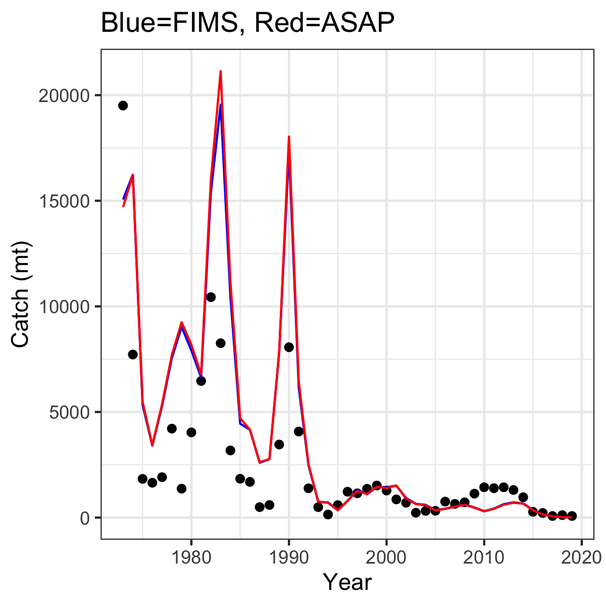
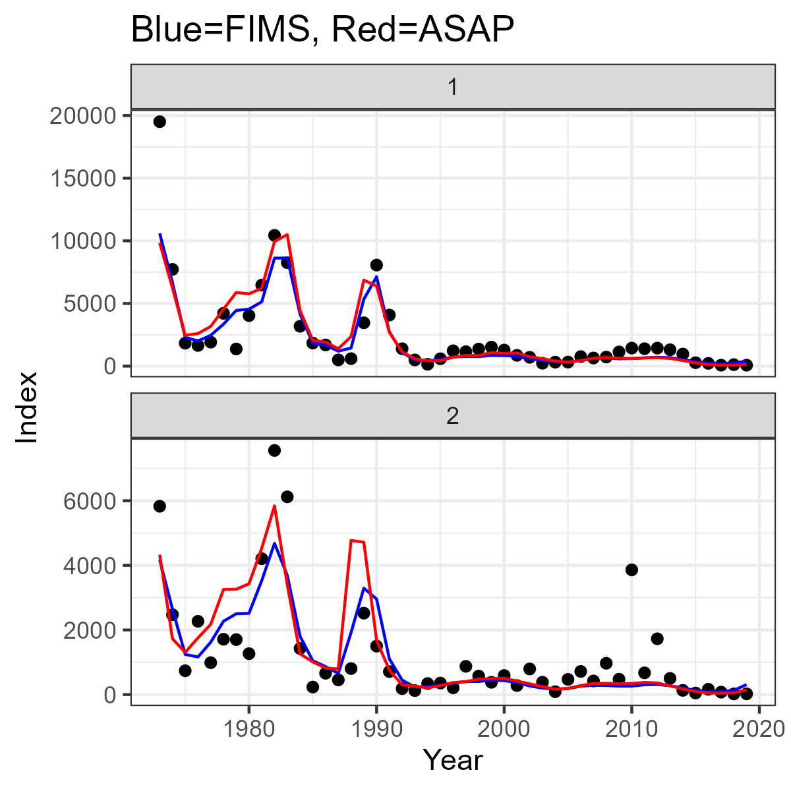
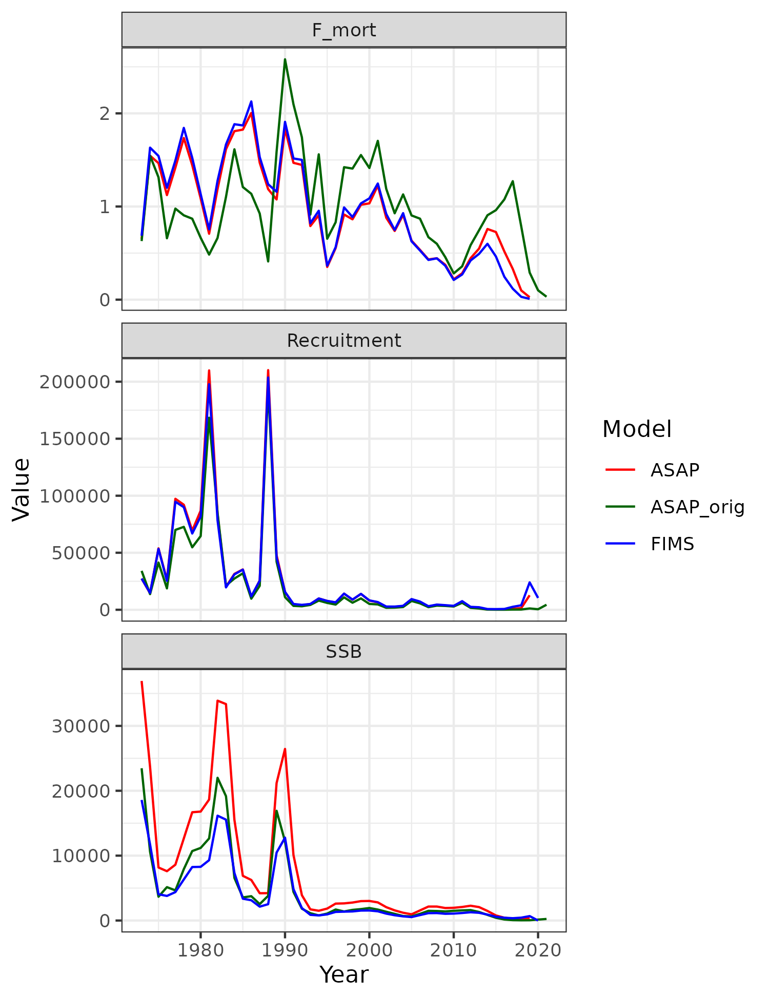
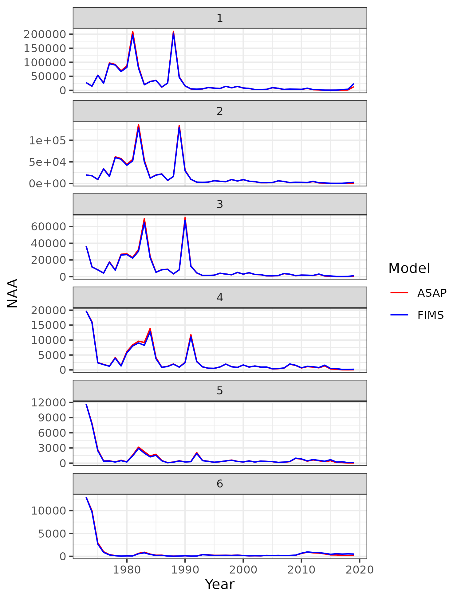

## The setup



```{r}
#| warning: false
#| label: startup

# R_version <- version$version.string
# TMB_version <- packageDescription("TMB")$Version
# FIMS_commit <- substr(packageDescription("FIMS")$GithubSHA1, 1, 7)
```

-   R version: `r R_version`\
-   TMB version: `r TMB_version`\
-   FIMS commit: `r FIMS_commit`\
-   Stock name: Southern New England-Mid Atlantic Yellowtail Flounder\
-   Region: NEFSC\
-   Analyst: Chris Legault\

## Simplifications to the original assessment

* End year 2021 to 2019 due to missing 2020 survey
* 5 indices to 2
* Filled a survey missing year for one index (see below)
* Varying weight at age to constant over time
* Different weight at age matrices for catch, SSB, Jan-1 to same for all 3
* SSB calculated in April to Jan-1
* Aggregate index in numbers to weight
* Fishery 2 selectivity blocks to 1
* Catch and Index selectivity at age to logistic
* Index timing from April to Jan-1
* Varying Index CV to constant over time
* Varying Catch ESS to constant over time
* SR unexploited scaler SSB to recruitment


How I simplified my assessment:

To fill the missing year of survey data, I first ran the model in ASAP with the missing data treated as missing. I then filled the missing data with the expected value of the survey, both in aggregate and for catch at age in place of the missing data.

The varying weights at age, index CVs, and ESS values were replaced by the time series mean in all years.

The catch weight at age matrix was used as the weight at age for all sources.

## Script that sets up and runs the model
```{r}
#| warning: false
#| label: run-fims

# clear memory
clear()

# read the ASAP rdat files
rdat <- dget(file.path("data_files", "NEFSC_YT_SIMPLIFIED.RDAT")) # to be used in FIMS, lots of modifications from original
orig <- dget(file.path("data_files", "NEFSC_YT_ORIGINAL.RDAT"))   # where started before modifications for use in FIMS

# function to create equivalent of data_mile1, basic catch and survey data
# need to think about how to deal with multiple fleets and indices - only use 1 of each for now
get_asap_data <- function(rdat){
  res <- data.frame(type = character(),
                name = character(),
                age = integer(),
                datestart = character(),
                dateend = character(),
                value = double(),
                unit = character(),
                uncertainty = double())
  
  landings <- data.frame(type = "landings",
                     name = "fleet1",
                     age = NA,
                     datestart = paste0(seq(rdat$parms$styr, rdat$parms$endyr), "-01-01"),
                     dateend = paste0(seq(rdat$parms$styr, rdat$parms$endyr), "-12-31"),
                     value = as.numeric(rdat$catch.obs[1,]),
                     unit = "mt",
                     uncertainty = rdat$control.parms$catch.tot.cv[,1])
  
  # loop over all indices
  for (i in 1:rdat$parms$nindices){
    index <- data.frame(type = "index",
                        name = paste0("survey", i),
                        age = NA,
                        datestart = paste0(seq(rdat$parms$styr, rdat$parms$endyr), "-01-01"),
                        dateend = paste0(seq(rdat$parms$styr, rdat$parms$endyr), "-12-31"),
                        value = as.numeric(rdat$index.obs[[i]]),
                        unit = "",
                        uncertainty = rdat$index.cv[[i]])
    if (i == 1){
      allinds <- index
    }else{
      allinds <- rbind(allinds, index)
    }
  }
  
  catchage <- data.frame(type = "age",
                     name = "fleet1",
                     age = rep(seq(1,rdat$parms$nages), rdat$parms$nyears),
                     datestart = rep(paste0(seq(rdat$parms$styr, rdat$parms$endyr), "-01-01"), each=rdat$parms$nages),
                     dateend = rep(paste0(seq(rdat$parms$styr, rdat$parms$endyr), "-12-31"), each=rdat$parms$nages),
                     value = as.numeric(t(rdat$catch.comp.mats$catch.fleet1.ob)),
                     unit = "",
                     uncertainty = rep(rdat$fleet.catch.Neff.init[1,], each=rdat$parms$nages))
  
  # loop over all indices
  for (i in 1:rdat$parms$nindices){
    indexage <- data.frame(type = "age",
                           name = paste0("survey", i),
                           age = rep(seq(1,rdat$parms$nages), rdat$parms$nyears),
                           datestart = rep(paste0(seq(rdat$parms$styr, rdat$parms$endyr), "-01-01"), each=rdat$parms$nages),
                           dateend = rep(paste0(seq(rdat$parms$styr, rdat$parms$endyr), "-12-31"), each=rdat$parms$nages),
                           value = as.numeric(t(rdat$index.comp.mats[[i*2-1]])),
                           unit = "",
                           uncertainty = rep(rdat$index.Neff.init[i,], each=rdat$parms$nages))
    if (i == 1){
      allindsage <- indexage
    }else{
      allindsage <- rbind(allindsage, indexage)
    }
  }
  
  weight_at_age <- data.frame(
    type = "weight-at-age",
    name = "fleet1",
    age = seq(rdat$parms$nages),
    datestart = paste0(rdat$parms$styr, "-01-01"),
    dateend = paste0(rdat$parms$endyr, "-01-01"),
    value = rdat$WAA.mats$WAA.catch.all[1,],
    unit = "mt",
    uncertainty = NA
  )

  res <- rbind(res, landings, allinds, catchage, allindsage, weight_at_age)
  return(res)
}

mydat <- get_asap_data(rdat)

# define the dimensions
nyears <- rdat$parms$nyears
years <- seq(rdat$parms$styr, rdat$parms$endyr)
nseasons <- 1 # ASAP only has one season
nages <- rdat$parms$nages
ages <- 1:nages # ASAP starts at age 1


# set up FIMS data objects
age_frame <- FIMS::FIMSFrame(mydat)

# set up selectivities for fleets and survey
fleet1 <- survey1 <- survey2 <- list(
  selectivity = list(form = "LogisticSelectivity"),
  data_distribution = c(
    Index = "DlnormDistribution",
    AgeComp = "DmultinomDistribution"
  )
)
# Should selectivity of survey2 be double logistic?

default_parameters <- age_frame |>
  create_default_parameters(
    fleets = list(
      fleet1 = fleet1,
      survey1 = survey1,
      survey2 = survey2
    )
  ) |>
  update_parameters(
    modified_parameters = list(
      fleet1 = list(
        LogisticSelectivity.inflection_point.value = rdat$sel.input.mats$fleet.sel.ini[nages+1,1],
        LogisticSelectivity.slope.value = rdat$sel.input.mats$fleet.sel.ini[nages+2,1],
        Fleet.log_Fmort.value = log(rep(rdat$initial.guesses$Fmult.year1.init[1], nyears)), # ASAP assumes Fmult devs = 0
        # FIX: Users should not have to reset the uncertainty for a fleet when this information
        #      is already in the data, it should be stored and pulled out automatically in
        #      create_default_parameters(). For index data too.
        # DlnormDistribution.log_sd.value = rep(log(sqrt(log(as.numeric(mean(rdat$control.parms$catch.tot.cv[,1], na.rm=TRUE)^2) + 1))), nyears)
        # KFJ: removed the log
        DlnormDistribution.log_sd.value = rep(sqrt(log(as.numeric(mean(rdat$control.parms$catch.tot.cv[,1], na.rm=TRUE)^2) + 1)), nyears)
      ),
      survey1 = list(
        # FIX: A bug in previous example where inflection.point was set twice rather
        #      than setting slope, copy and paste error so I am not sure where to get
        #      the true slope value from and the inflection point initial value does
        #      seem to be correct so I am using the default values
        Fleet.log_q.value = log(rdat$initial.guesses$q.year1.init[1]),
        # sd = sqrt(log(cv^2 + 1)), sd is log transformed
        # KFJ Removed the log, also I do not think that we have to repeat the value
        # and we can just provide a single value if they are all the same
        DlnormDistribution.log_sd.value = rep(sqrt(log(as.numeric(mean(rdat$index.cv[[1]], na.rm=TRUE)^2 + 1))), nyears)
      ),
      survey2 = list(
        # KFJ: A bug in previous code where the selectivity of survey2 was mapped on top of survey1
        Fleet.log_q.value = log(rdat$initial.guesses$q.year1.init[2]),
        # sd = sqrt(log(cv^2 + 1)), sd is log transformed
        # KFJ Removed the log, also I do not think that we have to repeat the value
        # and we can just provide a single value if they are all the same
        DlnormDistribution.log_sd.value = rep(sqrt(log(as.numeric(mean(rdat$index.cv[[2]], na.rm=TRUE)^2 + 1))), nyears)
      )
    )
  ) |>
  update_parameters(
    modified_parameters = list(
      # Recruitment
      recruitment = list(
        # ASAP can enter either R0 or SSB0, need to make sure use R0 in input file
        BevertonHoltRecruitment.log_rzero.value = log(rdat$initial.guesses$SR.inits$SR.scaler.init),
        # note: do not set steepness exactly equal to 1, use 0.99 instead in ASAP run
        BevertonHoltRecruitment.logit_steep.value = -log(1.0 - rdat$initial.guesses$SR.inits$SR_steepness.init) + log(rdat$initial.guesses$SR.inits$SR_steepness.init - 0.2),
        # KFJ: did not log it
        DnormDistribution.log_sd.value = mean(rdat$control.parms$recruit.cv), # typically enter same value for every year in ASAP,
        BevertonHoltRecruitment.log_devs.estimated = TRUE,
        # KFJ had to subtract one year
        BevertonHoltRecruitment.log_devs.value = rep(1.0, nyears - 1)
      ),
      # Maturity
      # NOTE, to match FIMS for a protogynous stock, these maturity values were obtained by fitting a logistic fcn to the age vector,
      # mat.female*prop.female + mat.male*prop.male and then assuming an all female population 
      maturity = list(
        LogisticMaturity.inflection_point.value =  1.8, # hardwired for now, need to figure out a better way than this
        LogisticMaturity.inflection_point.estimated = FALSE,
        LogisticMaturity.slope.value = 4, # hardwired for now, need to figure out a better way than this
        LogisticMaturity.slope.estimated = FALSE
      ),
      population = list(
        # M is vector of age1 M X nyrs then age2 M X nyrs
        Population.log_M.value = log(as.numeric(t(rdat$M.age))),
        Population.log_M.estimated = FALSE,
        Population.log_init_naa.value = log(rdat$N.age[1,]), # log(rdat$initial.guesses$NAA.year1.init)
        Population.log_init_naa.estimated = FALSE
      )
    )
  )

# Put it all together, creating the FIMS model and making the TMB fcn
# Run the model without optimization to help ensure a viable model
test_fit <- default_parameters |>
  initialize_fims(data = age_frame) |>
  fit_fims(optimize = FALSE)
# Run the  model with optimization
fit <- default_parameters |>
  initialize_fims(data = age_frame) |>
  fit_fims(optimize = TRUE)


# eventually change to allow multiple fishing fleets similar to multiple indices - only using 1 fishing fleet for now
# FIX: Why does a fishing fleet have a q?
# fishing_fleet$log_q <- log(rdat$initial.guesses$q.year1.init[1])
# fishing_fleet$estimate_q <- FALSE
# fishing_fleet$random_q <- FALSE

# NOTE: FIMS assumes SSB calculated at the start of the year, so need to adjust ASAP to do so as well for now, need to make timing of SSB calculation part of FIMS later
# NOTE: for now tricking FIMS into thinking age 0 is age 1, so need to adjust A50 for maturity because FIMS calculations use ages 0-5+ instead of 1-6

sdr <- get_sdreport(fit)
sdr_fixed <- summary(sdr, "fixed")
report <- get_report(fit)

### Plotting

mycols <- c("FIMS" = "blue", "ASAP" = "red", "ASAP_orig" = "darkgreen")

for (i in 1:rdat$parms$nindices){
  index_results <- data.frame(
    survey = i,
    year = years,
    observed = rdat$index.obs[[i]],
    FIMS = report$exp_index[[rdat$parms$nfleet+i]],
    ASAP = rdat$index.pred[[i]]
  )
  if (i==1){
    allinds_results <- index_results
  }else{
    allinds_results <- rbind(allinds_results, index_results)
  }
}
#print(allinds_results)

comp_index <- ggplot2::ggplot(allinds_results, ggplot2::aes(x = year, y = observed)) +
  ggplot2::geom_point() +
  ggplot2::geom_line(ggplot2::aes(x = year, y = FIMS), color = "blue") +
  ggplot2::geom_line(ggplot2::aes(x = year, y = ASAP), color = "red") +
  ggplot2::facet_wrap(~survey, scales = "free_y", nrow = 2) +
  ggplot2::xlab("Year") +
  ggplot2::ylab("Index") +
  ggplot2::ggtitle("Blue=FIMS, Red=ASAP") +
  ggplot2::theme_bw()
#print(comp_index)

catch_results <- data.frame(
  observed = get_data(age_frame) |>
    dplyr::filter(type == "index", name == "survey1") |>
    dplyr::pull(value),
  FIMS = report$exp_index[[1]],
  ASAP = as.numeric(rdat$catch.pred[1,])
)
#print(catch_results)

comp_catch <- ggplot2::ggplot(catch_results, ggplot2::aes(x = years, y = observed)) +
  ggplot2::geom_point() +
  ggplot2::xlab("Year") +
  ggplot2::ylab("Catch (mt)") +
  ggplot2::geom_line(ggplot2::aes(x = years, y = FIMS), color = "blue") +
  ggplot2::geom_line(ggplot2::aes(x = years, y = ASAP), color = "red") +
  ggplot2::ggtitle("Blue=FIMS, Red=ASAP") +
  ggplot2::theme_bw()
#print(comp_catch)

pop_results <- data.frame(
  Year = c(years, max(years)+1, years, years, years, years, max(years)+1, years),
  Metric = c(rep("SSB", 2*nyears+1), rep("F_mort", 2*nyears), rep("Recruitment", 2*nyears+1)),
  Model = c(rep("FIMS", nyears+1), rep("ASAP", nyears), rep(c("FIMS", "ASAP"), each=nyears), 
             rep("FIMS", nyears+1), rep("ASAP", nyears)),
  Value = c(report$ssb[[1]], rdat$SSB, report$F_mort[[1]], rdat$F.report, report$recruitment[[1]], as.numeric(rdat$N.age[,1]))
)
#print(pop_results)

# ggplot(filter(pop_results, Year <=2019), aes(x=Year, y=Value, color=Model)) +
#   geom_line() +
#   facet_wrap(~Metric, ncol=1, scales = "free_y") +
#   theme_bw() +
#   scale_color_manual(values = mycols)

orig_years <- seq(orig$parms$styr, orig$parms$endyr)
orig_pop_results <- data.frame(
  Year = rep(orig_years, 3),
  Metric = rep(c("SSB", "F_mort", "Recruitment"), each = length(orig_years)),
  Model = "ASAP_orig",
  Value = c(orig$SSB, orig$F.report, as.numeric(orig$N.age[,1]))
)

pop_results_3 <- rbind(pop_results, orig_pop_results)
#print(pop_results_3)

# ggplot(filter(pop_results_3, Year <=2019), aes(x=Year, y=Value, color=Model)) +
#   geom_line() +
#   facet_wrap(~Metric, ncol=1, scales = "free_y") +
#   theme_bw() +
#   scale_color_manual(values = mycols)

comp_FRSSB3 <- ggplot(pop_results_3, aes(x=Year, y=Value, color=Model)) +
  geom_line() +
  facet_wrap(~Metric, ncol=1, scales = "free_y") +
  theme_bw() +
  scale_color_manual(values = mycols)
#print(comp_FRSSB3)

FIMS_naa_results <- data.frame(
  Year = rep(c(years, max(years)+1), each = nages),
  Age = rep(ages, nyears+1),
  Metric = "NAA",
  Model = "FIMS",
  Value = report$naa[[1]]
)

ASAP_naa_results <- data.frame(
  Year = rep(years, each = nages),
  Age = rep(ages, nyears),
  Metric = "NAA",
  Model = "ASAP",
  Value = as.numeric(t(rdat$N.age))
)

orig_naa_results <- data.frame(
  Year = rep(orig_years, each = nages),
  Age = rep(ages, length(orig_years)),
  Metric = "NAA",
  Model = "ASAP_orig",
  Value = as.numeric(t(orig$N.age))
)
naa_results <- rbind(FIMS_naa_results, ASAP_naa_results, orig_naa_results)
#print(naa_results)

# ggplot(filter(naa_results, Year <= 2019), aes(x=Year, y=Value, color=Model)) +
#   geom_line() +
#   facet_wrap(~Age, ncol=1, scales = "free_y") +
#   ylab("NAA") +
#   theme_bw() +
#   scale_color_manual(values = mycols)

comp_naa2 <- ggplot(filter(naa_results, Year <= 2019, Model %in% c("ASAP", "FIMS")), aes(x=Year, y=Value, color=Model)) +
  geom_line() +
  facet_wrap(~Age, ncol=1, scales = "free_y") +
  ylab("NAA") +
  theme_bw() +
  scale_color_manual(values = mycols)
#print(comp_naa2)

# ggplot(filter(naa_results, Year == 1973, Model %in% c("ASAP", "FIMS")), aes(x=Age, y=Value, color=Model)) +
#   geom_line() +
#   ylab("NAA in Year 1") +
#   theme_bw() +
#   scale_color_manual(values = mycols)


saveplots <- TRUE
if(saveplots){
  ggsave(filename = "figures/NEFSC_YT_compare_index.png", plot = comp_index, width = 4, height = 4, units = "in")
  ggsave(filename = "figures/NEFSC_YT_compare_catch.png", plot = comp_catch, width = 4, height = 4, units = "in")
  ggsave(filename = "figures/NEFSC_YT_compare_FRSSB3.png", plot = comp_FRSSB3, width = 5, height = 6.5, units = "in")
  ggsave(filename = "figures/NEFSC_YT_compare_NAA2.png", plot = comp_naa2, width = 5, height = 6.5, units = "in")
}

```
## Comparison figures
{width=4in}
{width=4in}
{width=4in}
{width=4in}

## Comparison table

The likelihood components from FIMS and ASAP for the same data are shown in the table below. Note that the ASAP file had to turn on the use likelihood constants option to enable this comparison (this option should not be used when recruitment deviations are estimated).

```{r}
#| label: comparison-table
jnlltab <- data.frame(Component=c("Total","Index","Age Comp", "Rec"),
                      FIMS = c(report$jnll, report$index_nll, report$age_comp_nll, report$rec_nll),
                      ASAP = c(rdat$like$lk.total,
                               (rdat$like$lk.catch.total + rdat$like$lk.index.fit.total),
                               (rdat$like$lk.catch.age.comp + rdat$like$lk.index.age.comp),
                               rdat$like$lk.Recruit.devs))
print(jnlltab)
```

## What was your experience using FIMS? What could we do to improve usability?

Relatively easy to use by following the vignette. Creating wrappers for data input would help so that each element did not need to be assigned directly. 

## List any issues that you ran into or found

Please [open an issue](https://github.com/NOAA-FIMS/FIMS/issues/new/choose) if you found something new.

* SSB calculations in FIMS assume 0.5 multiplier, which differs from ASAP [Issue #521](https://github.com/NOAA-FIMS/FIMS/issues/521).
* Output all derived values (this is mostly done)
* Fix recruitment estimation [Issue #364](https://github.com/NOAA-FIMS/FIMS/issues/364)
* Handle missing data, especially surveys [Issue #502](https://github.com/NOAA-FIMS/FIMS/issues/502)
* Weights at age that change over time
* Separate weights at age for catch, SSB, Jan-1 population, indices, etc.
* Fishery selectivity blocks or random effects
* Allow time-varying CVs and ESS (or alternative functions)
* Option for Index in numbers
* Timing of Index and SSB calculations within the year
* One-step-ahead residuals
* Reference points, projections, pushbutton retro

## What features are most important to add based on this case study?

* Missing values, would allow inclusion of the other 3 indices (too many missing years to fill for this example)

```{r}
#| label: clear-C++-objects-from-memory
# Clear C++ objects from memory
clear()
```
