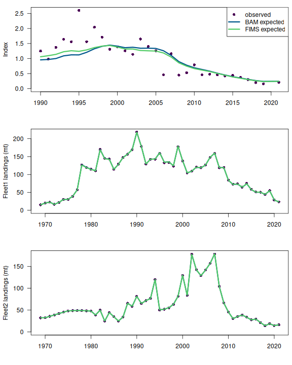
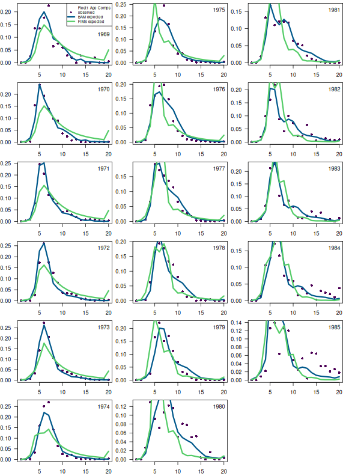
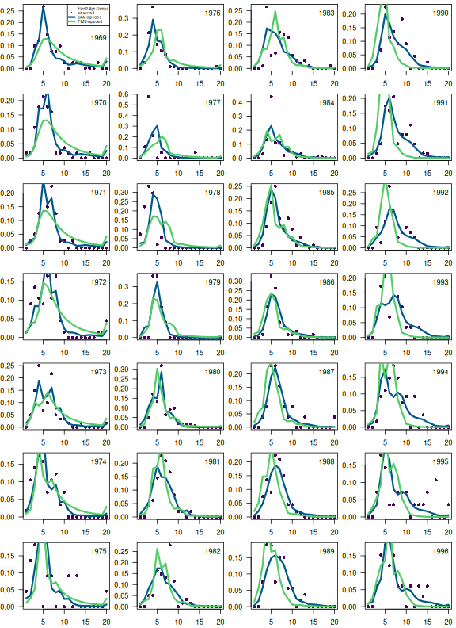
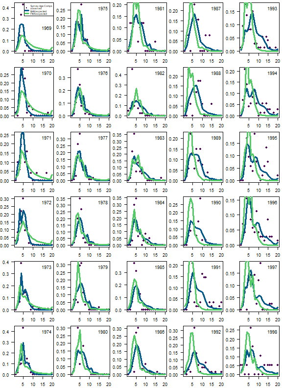
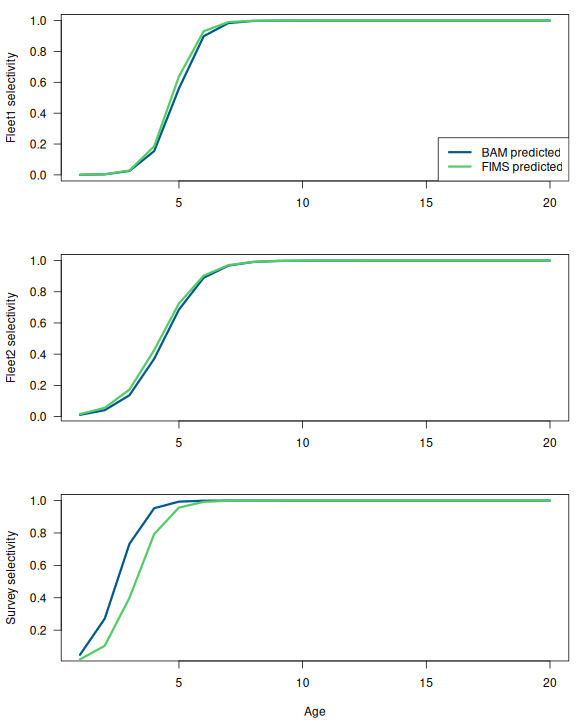
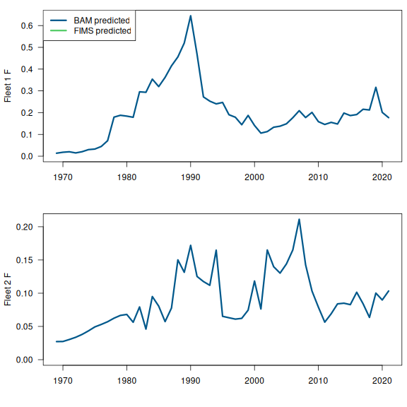
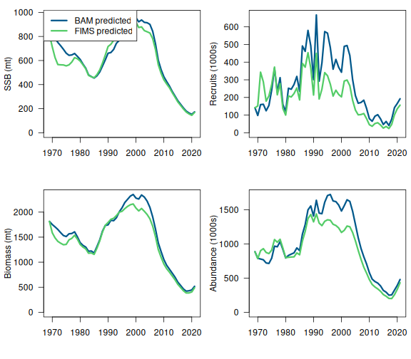

## The setup



```{r}
#| label: setup-objects
common_name <- "South Atlantic scamp grouper"
```

* R version: `r R_version`
* TMB version: `r TMB_version`
* FIMS commit: `r FIMS_commit`
* Stock name: `r common_name`
* Region: SEFSC
* Analyst: Kyle Shertzer

## Simplifications to the original assessment

The model presented in this case study was changed substantially from the operational version and should not be considered reflective of the `r common_name` stock. These results are intended to be a demonstration and nothing more.

To get the operational model to more closely match a FIMS model the following changes were made:

The original stock assessment ([SEDAR-68OA](https://sedarweb.org/documents/sedar-68oa-south-atlantic-scamp-operational-assessment-final-stock-assessment-report/)) was conducted using the Beaufort Assessment Model (BAM). That assessment included details not yet available in FIMS. So, the following simplifications or modifications were made to the BAM configuration to allow more direct comparisons with FIMS output. These assessments and comparisons are for demonstration only.

* Set spawning biomass calculations to occur on Jan. 1, rather than the time of peak spawning.
* Set abundance calculations for matching index data to occur on Jan. 1, rather than mid-year sampling.
* Dropped time blocks on selectivity for fleets.
* Dropped all length-composition data.
* Dropped the estimation of the variation in size at age, as this parameter is not estimable without length-composition data.
* Converted index data and predictions to occur in weight rather than numbers.
* Converted spawning biomass to be female only. Because scamp are a protogynous hermaphrodite, the original assessment accounted for males implicitly by computing spawning biomass as the sum of total (male + female) mature biomass. One way to match that accounting would be to assume that the female maturity vector equals that of both sexes combined, and then further assume that the population is 100% female. However, current FIMS (1 July 2024) does not allow deviation from a 50:50 sex ratio. Thus, for this example, FIMS and BAM use the maturity vector of both sexes combined, but apply that vector only to females and assume a 50:50 sex ratio when computing spawning biomass.
* Female maturity at age modeled as a logistic function, rather than empirical.
* Extended estimates of recruitment deviations forward in time to the terminal year. Based on likelihood profiling, values from the last two years were not estimable, and thus were fixed in the original assessment.
* Extended estimates of recruitment deviations backward in time to the initial year, 1969. The original assessment started estimating recruitment deviations in 1980, when age-composition data become available.
* Dropped the fishery-dependent growth curve and set mean size at age of the landings equal to the population growth curve.
* Converted all observed and predicted landings to weight (mt). The original assessment used units native to the data collection: commercial in pounds and recreational in numbers.
* Replaced Dirichlet-multinomial with standard multinomial distribution for fitting age-composition data.
* Extended age compositions to include ages 1--20+, as modeled in the population. The original assessment modeled ages 1--20+ in the population but fit ages 1--15+ in the age compositions because of many zeros in the 16--20 age range.
* Dropped fishery-dependent indices. This was for simplicity, as modeling those indices would require mirroring a fleet's selectivity, which is not something I currently know how to do in FIMS.

## Setting up the data

The data for the FIMS model was created from reading in a simplified version of the BAM model via an .Rdat file.

```{r}
#| warning: false
#| label: prepare-fims-data
#| output: false

# clear memory
FIMS::clear()
grDevices::graphics.off()

# get scamp data and output from simplified version of BAM
rdat_file_name <- file.path(data_directory, "scamp32o.rdat")
sca <- dget(rdat_file_name)

# Set dimensions
styr <- dplyr::first(sca$t.series$year)
endyr <- dplyr::last(sca$t.series$year)
years <- styr:endyr
n_years <- endyr - styr + 1 # the number of years which we have data for
ages <- sca$a.series$age # age vector.
n_ages <- length(ages) # the number of age groups.

# Prepare data; initialize all values with -999 (missing)
# fleet1 is commercial, fleet2 is recreational
fleet1_ac <- fleet2_ac <- survey_ac <- matrix(-999, nrow = n_years, ncol = n_ages)

# CV is arithmetic space and what is used to fit in BAM, which we convert to
# standard deviation and create_default_DlnormDistribution takes the log of it
# for you so we want sqrt(log(1.0 + fleet1_landings_cv^2))
fleet1_landings <- sca$t.series$L.COM.ob
fleet1_landings_cv <- sca$t.series$cv.L.COM
fleet1_landings_sd <- sqrt(log(1.0 + fleet1_landings_cv^2))
fleet2_landings <- sca$t.series$L.REC.ob
fleet2_landings_cv <- sca$t.series$cv.L.REC
fleet2_landings_sd <- sqrt(log(1.0 + fleet2_landings_cv^2))

survey_index <- sca$t.series$U.CVT.ob |>
  tidyr::replace_na(-999)
survey_index_cv <- sca$t.series$cv.U.CVT
survey_index_sd <- sqrt(log(1.0 + survey_index_cv^2)) |>
  tidyr::replace_na(1) |>
  base::replace(n_years - 1, 1) # manually replacing the 2020 CV as a missing value

# COMMENT: These multinomial entries are not whole numbers and many <1. This is not
# technically correct but it does not seem to make a difference based on testing.
fleet1_ac_n <- sca$t.series$acomp.COM.n |> 
  tidyr::replace_na(1)
fleet2_ac_n <- sca$t.series$acomp.REC.n |>
  tidyr::replace_na(1)
survey_ac_n <- sca$t.series$acomp.CVT.n |>
  tidyr::replace_na(1)

fleet1_ac[!is.na(sca$t.series$acomp.COM.n), ] <- sca$comp.mats$acomp.COM.ob 
fleet2_ac[!is.na(sca$t.series$acomp.REC.n), ] <- sca$comp.mats$acomp.REC.ob 
survey_ac[!is.na(sca$t.series$acomp.CVT.n), ] <- sca$comp.mats$acomp.CVT.ob 

## put data into fims friendly form
fleet1_landings_df <- data.frame(
  type = "landings",
  name = "fleet1",
  age = NA,
  timing = seq(styr, endyr),
  value = as.numeric(fleet1_landings),
  unit = "mt",
  uncertainty = fleet1_landings_sd
)

fleet2_landings_df <- data.frame(
  type = "landings",
  name = "fleet2",
  age = NA,
  timing = seq(styr, endyr),
  value = as.numeric(fleet2_landings),
  unit = "mt",
  uncertainty = fleet2_landings_sd
)

survey_index_df <- data.frame(
  type = "index",
  name = "survey1",
  age = NA,
  timing = seq(styr, endyr),
  value = as.numeric(survey_index),
  unit = "",
  uncertainty = survey_index_sd
)

fleet1_ac_df <- data.frame(
  type = "age_comp",
  name = "fleet1",
  age = rep(seq(1, n_ages), n_years),
  timing = rep(seq(styr, endyr), each = n_ages),
  value = as.numeric(t(fleet1_ac)),
  unit = "",
  uncertainty = rep(fleet1_ac_n, each = n_ages)
)

fleet2_ac_df <- data.frame(
  type = "age_comp",
  name = "fleet2",
  age = rep(seq(1, n_ages), n_years),
  timing = rep(seq(styr, endyr), each = n_ages),
  value = as.numeric(t(fleet2_ac)),
  unit = "",
  uncertainty = rep(fleet2_ac_n, each = n_ages)
)

survey_ac_df <- data.frame(
  type = "age_comp",
  name = "survey1",
  age = rep(seq(1, n_ages), n_years),
  timing = rep(seq(styr, endyr), each = n_ages),
  value = as.numeric(t(survey_ac)),
  unit = "",
  uncertainty = rep(survey_ac_n, each = n_ages)
)

weight_at_age <- data.frame(
  type = "weight-at-age",
  name = "fleet1",
  age = seq(n_ages),
  timing = rep(styr, n_ages),
  value = sca$a.series$wgt.mt,
  unit = "mt",
  uncertainty = NA
)

landings <- rbind(fleet1_landings_df, fleet2_landings_df)
index <- survey_index_df
agecomps <- rbind(fleet1_ac_df, fleet2_ac_df, survey_ac_df)

data_4_model <- FIMS::FIMSFrame(
  rbind(landings, index, agecomps, weight_at_age)
)  
```

## Run FIMS model

```{r}
#| label: setup-model
default_parameters <- FIMS::create_default_configurations(data_4_model) |>
  FIMS::create_default_parameters(data_4_model) |>
  tidyr::unnest(cols = data) |> 
  # Maturity
  # NOTE, to match FIMS for a protogynous stock, these maturity values were
  # obtained by fitting a logistic function to the age vector,
  # mat.female*prop.female + mat.male*prop.male
  # and then assuming an all female population
  dplyr::rows_update(
    tibble::tibble(
      module_name = "Maturity",
      label = c("inflection_point", "slope"),
      value = c(2.254187, 1.659077)
    ),
    by = c("module_name", "label")
  ) |>
  dplyr::rows_update(
    tibble::tibble(
      module_name = "Selectivity",
      fleet_name = "fleet1",
      label = c("slope", "inflection_point"),
      value = c(sca$parm.cons$selpar_slope_COM2[8], sca$parm.cons$selpar_A50_COM2[8]),
      estimation_type = "constant"
    ),
    by = c("module_name", "fleet_name", "label")
  ) |>
  dplyr::rows_update(
    tibble::tibble(
      module_name = "Selectivity",
      fleet_name = "fleet2",
      label = c("slope", "inflection_point"),
      value = c(sca$parm.cons$selpar_slope1_REC2[8], sca$parm.cons$selpar_A50_REC2[8]),
      estimation_type = "constant"
    ),
    by = c("module_name", "fleet_name", "label")
  ) |>
  dplyr::rows_update(
    tibble::tibble(
      module_name = "Selectivity",
      fleet_name = "survey1",
      label = c("slope", "inflection_point"),
      value = c(sca$parm.cons$selpar_slope1_CVT[8], sca$parm.cons$selpar_A501_CVT[8]),
      estimation_type = "constant"
    ),
    by = c("module_name", "fleet_name", "label")
  ) |>
  dplyr::rows_update(
    tibble::tibble(
      module_name = "Population",
      label = c("log_M"),
      time = rep(years, each = n_ages),
      age = rep(ages, n_years),
      # M is vector of age1 M X nyrs then age2 M X nyrs
      value = log(as.numeric(matrix(
        rep(sca$a.series$M, each = n_years),
        nrow = n_years
      )))
    ),
    by = c("module_name", "label", "time", "age")
  ) |>
  dplyr::rows_update(
    tibble::tibble(
      module_name = "Population",
      label = "log_init_naa",
      age = ages,
      value = log(sca$N.age[1, ]),
      estimation_type = "constant"
    ),
    by = c("module_name", "label", "age")
  ) |>
  dplyr::rows_update(
    tibble::tibble(
      module_name = "Recruitment",
      # Transformed 0.999 to logit where a previous version just used 0.999
      # Should we use 0.75 as noted previously for scamp as the null model?
      label = c("log_rzero", "logit_steep", "log_sd"),
      value = c(sca$parm.cons$log_R0[8], -log(1.0 - 0.99) + log(0.99 - 0.2), sca$parm.cons$rec_sigma[8])
    ),
    by = c("module_name", "label")
  ) |>
  dplyr::rows_update(
    tibble::tibble(
      module_name = "Recruitment",
      label = "log_devs",
      time = years[-1],
      # The last value of the initial numbers at age is the first
      # recruitment deviation
      value = sca$t.series$logR.dev[-1],
    ),
    by = c("module_name", "label", "time")
  ) |>
  dplyr::rows_update(
    tibble::tibble(
      module_name = "Fleet",
      fleet_name = "fleet1",
      time = years,
      label = "log_Fmort",
      value = log(sca$t.series$F.COM)
    ),
    by = c("module_name", "fleet_name", "label", "time")
  ) |>
  dplyr::rows_update(
    tibble::tibble(
      module_name = "Fleet",
      fleet_name = "fleet2",
      time = years,
      label = "log_Fmort",
      value = log(sca$t.series$F.REC)
    ),
    by = c("module_name", "fleet_name", "label", "time")
  ) |>
  dplyr::rows_update(
    tibble::tibble(
      module_name = "Fleet",
      fleet_name = "survey1",
      time = years,
      label = "log_Fmort",
      value = log(sca$parms$q.CVT)
    ),
    by = c("module_name", "fleet_name", "label", "time")
  )

####################################################################################
# Run the  model with optimization
fit <- default_parameters |>
  FIMS::initialize_fims(data = data_4_model) |>
  FIMS::fit_fims(optimize = TRUE, get_sd = FALSE)

report <- FIMS::get_report(fit)
output_fims <- FIMS::get_estimates(fit) |>
  dplyr::mutate(
    uncertainty_label = "se",
    year = year_i + FIMS::get_start_year(data_4_model),
    estimate = estimated
  )

# Results stored in the BAM .Rdat file are converted to a standardized form
# using `stockplotr::convert_output(model = "bam")`.
output_bam <- stockplotr::convert_output(rdat_file_name, model = "bam")
```

```{r}
#| label: comparison-plots
######################################################################
# Plot results

# created by running colorspace::sequential_hcl(5, "Viridis")
cols <- c("#4B0055", "#00588B", "#009B95", "#53CC67", "#FDE333")

out.folder <- "figures"
dir.create(out.folder, showWarnings = FALSE)
plot.type <- "png"

get_selectivity_parameter <- function(fit, x) {
  good <- dplyr::filter(
    FIMS::get_estimates(fit),
    module_name == "Selectivity",
    label == x
  )
  out <- dplyr::pull(good, estimated)
  names(out) <- paste(
    dplyr::pull(good, label),
    dplyr::pull(good, parameter_id),
    sep = "_"
  )
  return(out)
}

selex.bam.fleet1 <- 1 / (1 + exp(-sca$parm.cons$selpar_slope_COM2[8] * (ages - sca$parm.cons$selpar_A50_COM2[8])))
selex.fims.fleet1 <- 1 / (1 + exp(-get_selectivity_parameter(fit, "slope")[1] * (ages - get_selectivity_parameter(fit, "inflection_point")[1])))
selex.bam.fleet2 <- 1 / (1 + exp(-sca$parm.cons$selpar_slope1_REC2[8] * (ages - sca$parm.cons$selpar_A50_REC2[8])))
selex.fims.fleet2 <- 1 / (1 + exp(-get_selectivity_parameter(fit, "slope")[2] * (ages - get_selectivity_parameter(fit, "inflection_point")[2])))
selex.bam.survey <- 1 / (1 + exp(-sca$parm.cons$selpar_slope1_CVT[8] * (ages - sca$parm.cons$selpar_A501_CVT[8])))
selex.fims.survey <- 1 / (1 + exp(-get_selectivity_parameter(fit, "slope")[3] * (ages - get_selectivity_parameter(fit, "inflection_point")[3])))


index_results_allyr <- data.frame(
  yr = styr:endyr,
  observed = FIMS::get_data(data_4_model) |>
    dplyr::filter(type == "index", name == "survey1") |>
    dplyr::pull(value),
  fims.expected = report$index_expected[[3]],
  bam.expected = sca$t.series$U.CVT.pr
)
index_results <- index_results_allyr |>
  dplyr::filter(observed != -999.00)
fleet1_landings_results <- data.frame(
  yr = styr:endyr,
  observed = FIMS::get_data(data_4_model) |>
    dplyr::filter(type == "landings", name == "fleet1") |>
    dplyr::pull(value),
  fims.expected = report$landings_expected[[1]],
  bam.expected = sca$t.series$L.COM.pr
)
fleet2_landings_results <- data.frame(
  yr = styr:endyr,
  observed = FIMS::get_data(data_4_model) |>
    dplyr::filter(type == "landings", name == "fleet2") |>
    dplyr::pull(value),
  fims.expected = report$landings_expected[[2]],
  bam.expected = sca$t.series$L.REC.pr
)

fleet1_F_results <- data.frame(
  yr = styr:endyr,
  fims.F.fleet1 = dplyr::filter(FIMS::get_estimates(fit), label == "log_Fmort", module_id == 1) |> dplyr::pull(estimated),
  bam.F.fleet1 = sca$t.series$F.COM
)
fleet2_F_results <- data.frame(
  yr = styr:endyr,
  fims.F.fleet2 = dplyr::filter(FIMS::get_estimates(fit), label == "log_Fmort", module_id == 2) |> dplyr::pull(estimated),
  bam.F.fleet2 = sca$t.series$F.REC
)

# Dropping the last (extra) year from FIMS output, assuming it is a projection yr (not an initialization yr)
fims.naa <- matrix(report$numbers_at_age[[1]], ncol = n_ages, byrow = TRUE)
fims.naa <- fims.naa[-54, ]
popn_results <- data.frame(
  yr = styr:endyr,
  fims.ssb = report$spawning_biomass[[1]][1:n_years],
  fims.recruits = report$expected_recruitment[[1]][1:n_years] / 1000,
  fims.biomass = report$biomass[[1]][1:n_years],
  fims.abundance = rowSums(fims.naa) / 1000,
  bam.ssb = sca$t.series$SSB,
  bam.recruits = sca$t.series$recruits / 1000,
  bam.biomass = sca$t.series$B,
  bam.abundance = sca$t.series$N / 1000
)

yr.ind <- 1:n_years

yr.fleet1.ind <- yr.ind[fleet1_ac_n >= 0]
yr.fleet1.ac <- years[yr.fleet1.ind]
fims.fleet1.ncaa <- matrix(report$landings_numbers_at_age[[1]], ncol = n_ages, byrow = TRUE)
fims.fleet1.ncaa <- fims.fleet1.ncaa[yr.fleet1.ind, ]
fims.fleet1.caa <- fims.fleet1.ncaa / rowSums(fims.fleet1.ncaa)
bam.fleet1.caa <- sca$comp.mats$acomp.COM.pr
obs.fleet1.caa <- sca$comp.mats$acomp.COM.ob

yr.fleet2.ind <- yr.ind[fleet2_ac_n >= 0]
yr.fleet2.ac <- years[yr.fleet2.ind]
fims.fleet2.ncaa <- matrix(report$landings_numbers_at_age[[2]], ncol = n_ages, byrow = TRUE)
fims.fleet2.ncaa <- fims.fleet2.ncaa[yr.fleet2.ind, ]
fims.fleet2.caa <- fims.fleet2.ncaa / rowSums(fims.fleet2.ncaa)
bam.fleet2.caa <- sca$comp.mats$acomp.REC.pr
obs.fleet2.caa <- sca$comp.mats$acomp.REC.ob

yr.survey.ind <- yr.ind[survey_ac_n >= 0]
yr.survey.ac <- years[yr.survey.ind]
fims.survey.ncaa <- matrix(report$landings_numbers_at_age[[3]], ncol = n_ages, byrow = TRUE)
fims.survey.ncaa <- fims.survey.ncaa[yr.survey.ind, ]
fims.survey.caa <- fims.survey.ncaa / rowSums(fims.survey.ncaa)
bam.survey.caa <- sca$comp.mats$acomp.CVT.pr
obs.survey.caa <- sca$comp.mats$acomp.CVT.ob
######################################################################
png(filename = paste(out.folder, "/SEFSC_scamp_tseries_fits.", plot.type, sep = ""), width = 8, height = 10, units="in", res=72)
mat <- matrix(1:3, ncol = 1)
layout(mat = mat, widths = rep.int(1, ncol(mat)), heights = rep.int(1, nrow(mat)))
par(las = 1, mar = c(4.1, 4.25, 1.0, 0.5), cex = 1)

plot(index_results$yr, index_results$observed,
  ylim = c(0, max(index_results[, -1])),
  pch = 16, col = cols[1], ylab = "Index", xlab = ""
)
lines(index_results$yr, index_results$bam.expected, lwd = 3, col = cols[2])
lines(index_results$yr, index_results$fims.expected, lwd = 3, col = cols[4])
legend("topright",
  legend = c("observed", "BAM expected", "FIMS expected"),
  pch = c(16, -1, -1), lwd = c(-1, 3, 3), col = c(cols[1], cols[2], cols[4])
)

plot(fleet1_landings_results$yr, fleet1_landings_results$observed,
  ylim = c(0, max(fleet1_landings_results[, -1])),
  pch = 16, col = cols[1], ylab = "Fleet1 landings (mt)", xlab = ""
)
lines(fleet1_landings_results$yr, fleet1_landings_results$bam.expected, lwd = 3, col = cols[2])
lines(fleet1_landings_results$yr, fleet1_landings_results$fims.expected, lwd = 3, col = cols[4])

plot(fleet2_landings_results$yr, fleet2_landings_results$observed,
  ylim = c(0, max(fleet2_landings_results[, -1])),
  pch = 16, col = cols[1], ylab = "Fleet2 landings (mt)", xlab = ""
)
lines(fleet2_landings_results$yr, fleet2_landings_results$bam.expected, lwd = 3, col = cols[2])
lines(fleet2_landings_results$yr, fleet2_landings_results$fims.expected, lwd = 3, col = cols[4])

dev.off()

######################################################################
png(filename = paste(out.folder, "/SEFSC_scamp_tseries_F.", plot.type, sep = ""), width = 8, height = 8, units="in", res=72)
mat <- matrix(1:2, ncol = 1)
layout(mat = mat, widths = rep.int(1, ncol(mat)), heights = rep.int(1, nrow(mat)))
par(las = 1, mar = c(4.1, 4.25, 1.0, 0.5), cex = 1)

plot(fleet1_F_results$yr, fleet1_F_results$bam.F.fleet1,
  ylim = c(0, max(fleet1_F_results[, -1])),
  type = "l", lwd = 3, col = cols[2], ylab = "Fleet 1 F", xlab = ""
)
lines(fleet1_F_results$yr, fleet1_F_results$fims.F.fleet1, lwd = 3, col = cols[4])
legend("topleft",
  legend = c("BAM predicted", "FIMS predicted"),
  lwd = c(3, 3), col = c(cols[2], cols[4])
)
plot(fleet2_F_results$yr, fleet2_F_results$bam.F.fleet2,
  ylim = c(0, max(fleet2_F_results[, -1])),
  type = "l", lwd = 3, col = cols[2], ylab = "Fleet 2 F", xlab = ""
)
lines(fleet2_F_results$yr, fleet2_F_results$fims.F.fleet2, lwd = 3, col = cols[4])

dev.off()

######################################################################
png(filename = paste(out.folder, "/SEFSC_scamp_selex.", plot.type, sep = ""), width = 8, height = 10, units="in", res=72)
mat <- matrix(1:3, ncol = 1)
layout(mat = mat, widths = rep.int(1, ncol(mat)), heights = rep.int(1, nrow(mat)))
par(las = 1, mar = c(4.1, 4.25, 1.0, 0.5), cex = 1)

plot(ages, selex.bam.fleet1, lwd = 3, col = cols[2], type = "l", xlab = "", ylab = "Fleet1 selectivity")
lines(ages, selex.fims.fleet1, lwd = 3, col = cols[4])
legend("bottomright",
  legend = c("BAM predicted", "FIMS predicted"),
  lwd = c(3, 3), col = c(cols[2], cols[4])
)
plot(ages, selex.bam.fleet2, lwd = 3, col = cols[2], type = "l", xlab = "", ylab = "Fleet2 selectivity")
lines(ages, selex.fims.fleet2, lwd = 3, col = cols[4])
plot(ages, selex.bam.survey, lwd = 3, col = cols[2], type = "l", xlab = "Age", ylab = "Survey selectivity")
lines(ages, selex.fims.survey, lwd = 3, col = cols[4])

dev.off()


######################################################################

png(filename = paste(out.folder, "/SEFSC_scamp_tseries_popn.", plot.type, sep = ""), width = 8, height = 7, units="in", res=72)
mat <- matrix(1:4, ncol = 2)
layout(mat = mat, widths = rep.int(1, ncol(mat)), heights = rep.int(1, nrow(mat)))
par(las = 1, mar = c(4.1, 4.25, 1.0, 0.5), cex = 1)

plot(popn_results$yr, popn_results$bam.ssb,
  ylim = c(0, max(popn_results[, c(2, 6)])),
  type = "l", lwd = 3, col = cols[2], ylab = "SSB (mt)", xlab = ""
)
lines(popn_results$yr, popn_results$fims.ssb, lwd = 3, col = cols[4])
legend("topleft",
  legend = c("BAM predicted", "FIMS predicted"),
  lwd = c(3, 3), col = c(cols[2], cols[4])
)

plot(popn_results$yr, popn_results$bam.biomass,
  ylim = c(0, max(popn_results[, c(4, 8)])),
  type = "l", lwd = 3, col = cols[2], ylab = "Biomass (mt)", xlab = ""
)
lines(popn_results$yr, popn_results$fims.biomass, lwd = 3, col = cols[4])

plot(popn_results$yr, popn_results$bam.recruits,
  ylim = c(0, max(popn_results[, c(3, 7)])),
  type = "l", lwd = 3, col = cols[2], ylab = "Recruits (1000s)", xlab = ""
)
lines(popn_results$yr, popn_results$fims.recruits, lwd = 3, col = cols[4])

plot(popn_results$yr, popn_results$bam.abundance,
  ylim = c(0, max(popn_results[, c(5, 9)])),
  type = "l", lwd = 3, col = cols[2], ylab = "Abundance (1000s)", xlab = ""
)
lines(popn_results$yr, popn_results$fims.abundance, lwd = 3, col = cols[4])

dev.off()

######################################################################
png(filename = paste(out.folder, "/SEFSC_scamp_caa_fleet1.", plot.type, sep = ""), width = 8, height = 11, units="in", res=72)
mat <- matrix(1:18, ncol = 3)
layout(mat = mat, widths = rep.int(1, ncol(mat)), heights = rep.int(1, nrow(mat)))
par(las = 1, mar = c(2.2, 2.7, 0.5, 0.5), cex = 0.75)

for (i in 1:nrow(obs.fleet1.caa))
{
  plot(1:n_ages, obs.fleet1.caa[i, ], col = cols[1], xlab = "", ylab = "", pch = 16)
  lines(1:n_ages, bam.fleet1.caa[i, ], lwd = 3, col = cols[2])
  lines(1:n_ages, fims.fleet1.caa[i, ], lwd = 3, col = cols[4])
  if (i > 1) legend("topright", legend = yr.fleet1.ac[i], cex = 1, bty = "n")
  if (i == 1) {
    legend("topright",
      legend = c("Fleet1 Age Comps", "observed", "BAM expected", "FIMS expected"),
      pch = c(-1, 16, -1, -1), lwd = c(-1, -1, 3, 3), col = c(cols[1], cols[1], cols[2], cols[4]), cex = 0.7
    )
    legend("right", legend = yr.fleet1.ac[i], cex = 1, bty = "n")
  }
}

dev.off()

######################################################################
png(filename = paste(out.folder, "/SEFSC_scamp_caa_fleet2.", plot.type, sep = ""), width = 8, height = 11, units="in", res=72)

mat <- matrix(1:28, ncol = 4)
layout(mat = mat, widths = rep.int(1, ncol(mat)), heights = rep.int(1, nrow(mat)))
par(las = 1, mar = c(2.2, 2.7, 0.5, 0.5), cex = 0.75)

for (i in 1:nrow(obs.fleet2.caa))
{
  plot(1:n_ages, obs.fleet2.caa[i, ], col = cols[1], xlab = "", ylab = "", pch = 16)
  lines(1:n_ages, bam.fleet2.caa[i, ], lwd = 3, col = cols[2])
  lines(1:n_ages, fims.fleet2.caa[i, ], lwd = 3, col = cols[4])
  if (i > 1) legend("topright", legend = yr.fleet2.ac[i], cex = 1, bty = "n")
  if (i == 1) {
    legend("topright",
      legend = c("Fleet2 Age Comps", "observed", "BAM expected", "FIMS expected"),
      pch = c(-1, 16, -1, -1), lwd = c(-1, -1, 3, 3), col = c(cols[1], cols[1], cols[2], cols[4]), cex = 0.5
    )
    legend("right", legend = yr.fleet2.ac[i], cex = 1, bty = "n")
  }
}

dev.off()

######################################################################
png(filename = paste(out.folder, "/SEFSC_scamp_caa_survey.", plot.type, sep = ""), width = 8, height = 11, units="in", res=72)

mat <- matrix(1:30, ncol = 5)
layout(mat = mat, widths = rep.int(1, ncol(mat)), heights = rep.int(1, nrow(mat)))
par(las = 1, mar = c(2.2, 2.7, 0.5, 0.5), cex = 0.75)

for (i in 1:nrow(obs.survey.caa))
{
  plot(1:n_ages, obs.survey.caa[i, ], col = cols[1], xlab = "", ylab = "", pch = 16)
  lines(1:n_ages, bam.survey.caa[i, ], lwd = 3, col = cols[2])
  lines(1:n_ages, fims.survey.caa[i, ], lwd = 3, col = cols[4])
  if (i > 1) legend("topright", legend = yr.survey.ac[i], cex = 1, bty = "n")
  if (i == 1) {
    legend("topright",
      legend = c("Survey Age Comps", "observed", "BAM expected", "FIMS expected"),
      pch = c(-1, 16, -1, -1), lwd = c(-1, -1, 3, 3), col = c(cols[1], cols[1], cols[2], cols[4]), cex = 0.5
    )
    legend("right", legend = yr.survey.ac[i], cex = 1, bty = "n")
  }
}

dev.off()

FIMS::clear()
```


## Comparison figures

{width=7in, fig-align="left"} 

{width=7in, fig-align="left"}

{width=7in, fig-align="left"}

{width=7in, fig-align="left"}

{width=7in, fig-align="left"}

{width=7in, fig-align="left"}

{width=7in, fig-align="left"}

## Figures with {stockplotr}

```{r}
#| label: plot-stockplotr
stockplotr::plot_biomass(
  list(
    "bam" = dplyr::filter(output_bam, module_name != "B.age") |>
      dplyr::mutate(module_name = ifelse(module_name == "t.series", "Population", module_name)),
    "fims" = output_fims
  )
)
```

## What was your experience using FIMS? What could we do to improve usability?

* Great joy when it finally worked!  But, it took a lot of time to first simplify the corresponding BAM implementation and then
to run FIMS successfully. \
* Data input seems complex for now. I was able to mimic previous examples, but would not likely have been successful starting from scratch. 
A user interface will presumably help simplify the process.\
*Clear distinction between "fleet" and "index" would be helpful. Examples of this confusion include 1) landings are defined using ```methods::new(Index, n_years)```
and ```spp_fleet1$SetObservedIndexData(spp_fleet1_landings$get_id())```, and 2) surveys are defined using ```methods::new(Fleet)```.\
*For simplification of the scamp example, I dropped two fishery dependent indices. My impression is that, in FIMS, fishery dependent indices would need to be defined as their own "fleet" and then *somehow* mirror the selectivity of the corresponding fishing fleet, presumably using TMB's mapping feature. 
I think it would be more straightforward if a fishery dependent index could be defined as an object linked to the fleet, similar to how landings and age comp
data are handled.\
-  When a model has multiple fleets, the function ```FIMS::m_landings``` concatenates all fleets' landings into one long vector. Thus, one must specify
correct indexing values when pulling landings by fleet from that concatenation. This seems clunky and error-prone, and it would be preferable
if ```FIMS::m_landings``` took fleet as an argument, similar to ```FIMS::m_agecomp```, so that landings by fleet could be obtained by fleet reference.\

## List any issues that you ran into or found

The FIMS feature to assign proportion female at age is not yet functional and
it is hard-coded using a 50:50 sex ratio. Many stocks
in the southeast are protogynous hermphrodites, such that individuals start life as females and later convert to males.
This life history creates a sex ratio that is tilted toward females for younger ages and males for older ages.


## What features are most important to add based on this case study?
* Discards. I chose this assessment as a case study because it did not explicitly model discards, and I knew that capability was not yet available in FIMS.
However, most assessments in the Southeast model dead discards.\
* Fitting to length composition data.\

## Acknowledgments
Thanks to Nathan Vaughan and Ian Taylor, who helped troubleshoot earlier versions of the code.

```{r}
#| label: cleanup
FIMS::clear()
```
