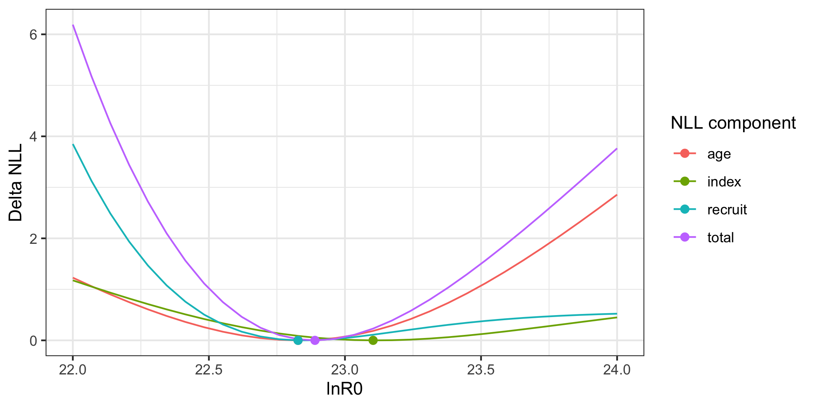
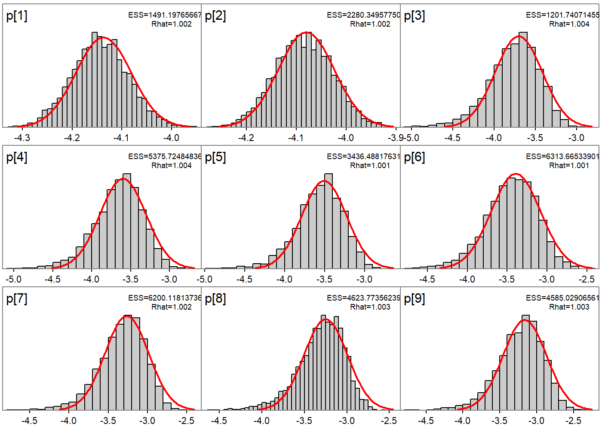
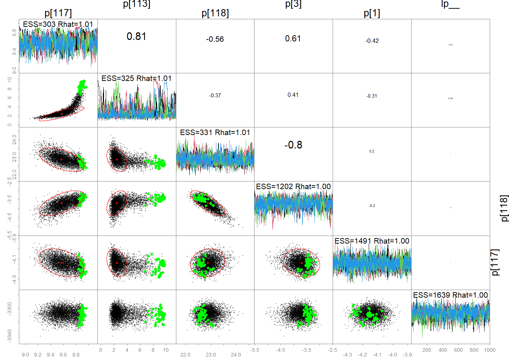
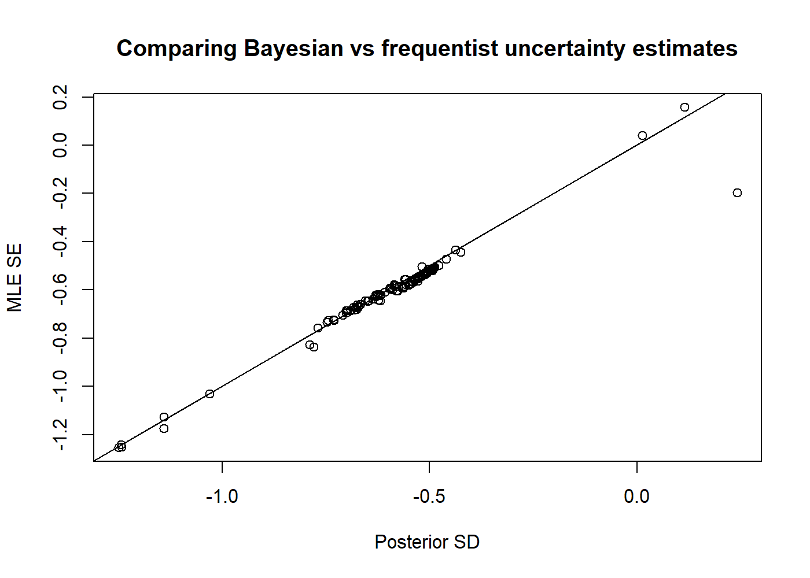
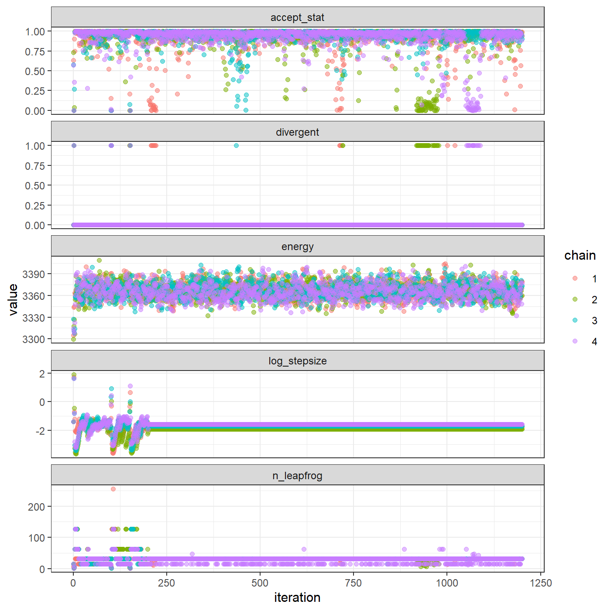
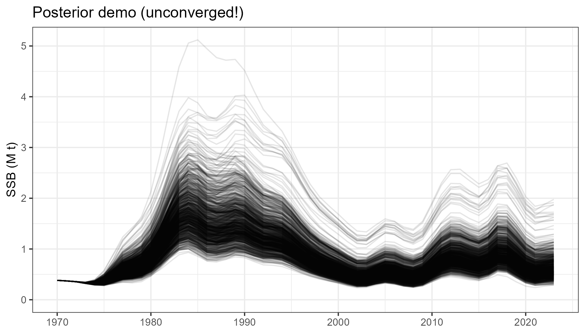
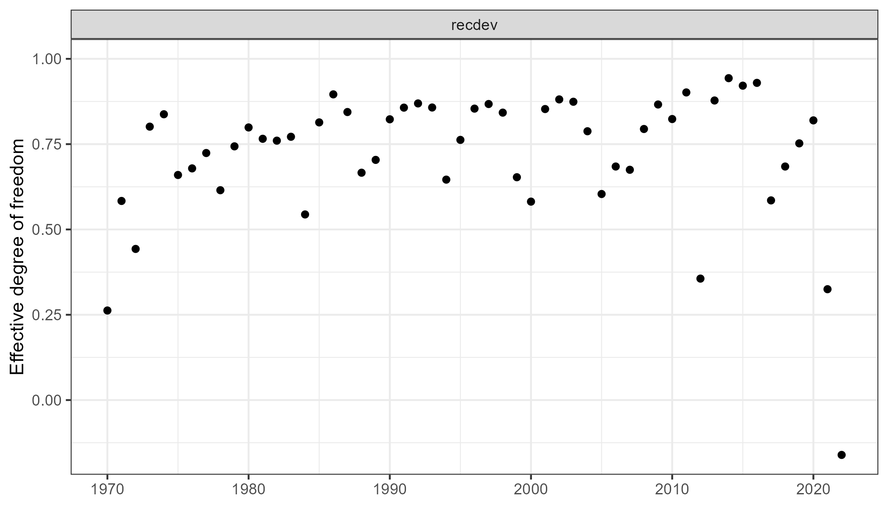

## The setup



```{r}
#| label: setup-objects
common_name <- "Gulf of Alaska walleye pollock"

# define the dimensions and global variables
years <- 1970:2023
n_years <- length(years)
ages <- 1:10
n_ages <- length(ages)
```

* R version: `r R_version`
* TMB version: `r TMB_version`
* FIMS commit: `r FIMS_commit`
* Stock name: `r common_name`
* Region: AFSC
* Analyst: Cole Monnahan

## Simplifications to the original assessment

The model presented in this case study was changed substantially from the operational version and should not be considered reflective of the `r common_name` stock. These results are intended to be a demonstration and nothing more.

To get the operational model to more closely match a FIMS model the following changes were made:

* See the AFSC-GOA-pollock case study for details on the production-level assessment model and how it was modified
* The focus here is on advanced features of FIMS rather than `r common_name` itself

## Script to prepare data for building FIMS object

```{r}
#| label: prepare-fims-data
#| output: false
#| warning: false

# This will fit the models bridging to FIMS (simplifying)
# source("fit_bridge_models.R")
# compare changes to model
pkfitfinal <- readRDS(file.path(data_directory, "pkfitfinal.RDS"))
pkfit0 <- readRDS(file.path(data_directory, "pkfit0.RDS"))
parfinal <- pkfitfinal$obj$env$parList()
pkinput0 <- readRDS(file.path(data_directory, "pkinput0.RDS"))
fimsdat <- pkdat0 <- pkinput0$dat
pkinput <- readRDS(file.path(data_directory, "pkinput.RDS"))
data_4_model <- prepare_pollock_data(
  pkfitfinal = pkfitfinal,
  pkfit0 = pkfit0,
  parfinal = parfinal,
  fimsdat = fimsdat,
  pkinput = pkinput,
  years = years,
  n_years = n_years,
  ages = ages,
  n_ages = n_ages
)
```

## Run FIMS model
```{r}
#| label: setup-model
#| output: false
#| warning: false

FIMS::clear()

estimate_fish_selex <- "fixed_effects"
estimate_survey_selex <- "fixed_effects"
estimate_q2 <- "fixed_effects"
estimate_q3 <- "fixed_effects"
estimate_q6 <- "fixed_effects"
estimate_F <- "fixed_effects"
estimate_recdevs <- TRUE

# Set up a FIMS model without wrapper functions

fishery_catch <- FIMS::m_landings(data_4_model, "fleet1")
fishery_agecomp <- FIMS::m_agecomp(data_4_model, "fleet1")
survey_index2 <- FIMS::m_index(data_4_model, "survey2")
survey_agecomp2 <- FIMS::m_agecomp(data_4_model, "survey2")
survey_index3 <- FIMS::m_index(data_4_model, "survey3")
survey_agecomp3 <- FIMS::m_agecomp(data_4_model, "survey3")
survey_index6 <- FIMS::m_index(data_4_model, "survey6")
survey_agecomp6 <- FIMS::m_agecomp(data_4_model, "survey6")
# need to think about how to deal with multiple fleets - only using 1 fleet for now
# TODO: FIMS now supports multiple fishing fleets. 
# We can test this feature using the case study to evaluate its functionality. 
fish_landings <- methods::new(Landings, n_years)
purrr::walk(
  seq_along(fishery_catch),
  \(x) fish_landings$landings_data$set(x - 1, fishery_catch[x])
)
fish_age_comp <- methods::new(AgeComp, n_years, n_ages)
purrr::walk(
  seq_along(fishery_agecomp),
  \(x) fish_age_comp$age_comp_data$set(
    x - 1,
    (fishery_agecomp *
    dplyr::filter(
      .data = get_data(data_4_model),
      type == "age_comp",
      name %in% "fleet1"
    ) |>
      dplyr::pull(uncertainty)
    )[x]
  )
)

### set up fishery
## fleet selectivity: converted from time-varying ascending
## slope/intercept to constant double-logistic
## methods::show(DoubleLogisticSelectivity)
fish_selex <- methods::new(DoubleLogisticSelectivity)
fish_selex$inflection_point_asc[1]$value <- parfinal$inf1_fsh_mean
fish_selex$inflection_point_asc[1]$estimation_type$set(estimate_fish_selex)
fish_selex$inflection_point_desc[1]$value <- parfinal$inf2_fsh_mean
fish_selex$inflection_point_desc[1]$estimation_type$set(estimate_fish_selex)
fish_selex$slope_asc[1]$value <- exp(parfinal$log_slp1_fsh_mean)
fish_selex$slope_asc[1]$estimation_type$set(estimate_fish_selex)
fish_selex$slope_desc[1]$value <- exp(parfinal$log_slp2_fsh_mean)
fish_selex$slope_desc[1]$estimation_type$set(estimate_fish_selex)

## create fleet object
fish_fleet <- methods::new(Fleet)
fish_fleet$n_ages$set(n_ages)
fish_fleet$n_years$set(n_years)

fish_fleet$log_Fmort$resize(n_years)
for (y in seq(n_years)) {
  # Log-transform OM fishing mortality
  fish_fleet$log_Fmort[y]$value <- log(pkfitfinal$rep$F[y])
}
fish_fleet$log_Fmort$set_all_estimable(TRUE)
fish_fleet$log_q[1]$value <- log(1.0) # why is this length two in Chris' case study?
fish_fleet$log_q[1]$estimation_type$set("constant")

# Set Index, AgeComp, and Selectivity using the IDs from the modules defined above
fish_fleet$SetObservedLandingsDataID(fish_landings$get_id())
fish_fleet$SetObservedAgeCompDataID(fish_age_comp$get_id())
fish_fleet$SetSelectivityID(fish_selex$get_id())

# Set up fishery index data using the lognormal
fish_fleet_index_distribution <- methods::new(DlnormDistribution)
# lognormal observation error transformed on the log scale
fish_fleet_index_distribution$log_sd$resize(n_years)
for (y in seq(n_years)) {
  # Compute lognormal SD from OM coefficient of variation (CV)
  fish_fleet_index_distribution$log_sd[y]$value <- log(fimsdat$cattot_log_sd[y])
}
fish_fleet_index_distribution$log_sd$set_all_estimable(FALSE)
# Set Data using the IDs from the modules defined above
fish_fleet_index_distribution$set_observed_data(fish_fleet$GetObservedLandingsDataID())
fish_fleet_index_distribution$set_distribution_links("data", fish_fleet$log_index_expected$get_id())

# Set up fishery age composition data using the multinomial
fish_fleet_agecomp_distribution <- methods::new(DmultinomDistribution)
fish_fleet_agecomp_distribution$set_observed_data(fish_fleet$GetObservedAgeCompDataID())
fish_fleet_agecomp_distribution$set_distribution_links("data", fish_fleet$agecomp_proportion$get_id())

## Setup survey 2
survey2_fleet_index <- methods::new(Index, n_years)
survey2_age_comp <- methods::new(AgeComp, n_years, n_ages)
purrr::walk(
  seq_along(survey_index2),
  \(x) survey2_fleet_index$index_data$set(x - 1, survey_index2[x])
)
purrr::walk(
  seq_along(survey_agecomp2),
  \(x) survey2_age_comp$age_comp_data$set(
    x - 1,
    (survey_agecomp2 *
    dplyr::filter(
      .data = get_data(data_4_model),
      type == "age_comp",
      name %in% "survey2"
    ) |>
      dplyr::pull(uncertainty)
    )[x]
  )
)

## survey selectivity: ascending logistic
## methods::show(DoubleLogisticSelectivity)
survey2_selex <- methods::new(DoubleLogisticSelectivity)
survey2_selex$inflection_point_asc[1]$value <- parfinal$inf1_srv2
survey2_selex$inflection_point_asc[1]$estimation_type$set(estimate_survey_selex)
survey2_selex$slope_asc[1]$value <- exp(parfinal$log_slp1_srv2)
survey2_selex$slope_asc[1]$estimation_type$set(estimate_survey_selex)
## not estimated to make it ascending only, fix at input values
survey2_selex$inflection_point_desc[1]$value <- parfinal$inf2_srv2
survey2_selex$inflection_point_desc[1]$estimation_type$set("constant")
survey2_selex$slope_desc[1]$value <- exp(parfinal$log_slp2_srv2)
survey2_selex$slope_desc[1]$estimation_type$set("constant")

survey2_fleet <- methods::new(Fleet)
survey2_fleet$n_ages$set(n_ages)
survey2_fleet$n_years$set(n_years)
survey2_fleet$log_Fmort$resize(n_years)
for (y in seq_along(years)) {
  # Set very low survey fishing mortality
  survey2_fleet$log_Fmort[y]$value <- -200
}
survey2_fleet$log_Fmort$set_all_estimable(FALSE)
survey2_fleet$log_q[1]$value <- parfinal$log_q2_mean
survey2_fleet$log_q[1]$estimation_type$set("fixed_effects")
survey2_fleet$SetSelectivityID(survey2_selex$get_id())
survey2_fleet$SetObservedIndexDataID(survey2_fleet_index$get_id())
survey2_fleet$SetObservedAgeCompDataID(survey2_age_comp$get_id())

survey2_fleet_index_distribution <- methods::new(DlnormDistribution)
# lognormal observation error transformed on the log scale
survey2_fleet_index_distribution$log_sd$resize(n_years)
temporary <- data.frame(
  index = survey_index2,
  log_sd = 0
)
temporary[which(temporary[, "index"] != -999), "log_sd"] <-
  fimsdat$indxsurv_log_sd2
for (y in which(temporary[, "index"] != -999)) {
 # Compute lognormal SD from OM coefficient of variation (CV)
 survey2_fleet_index_distribution$log_sd[y]$value <- log(
  temporary[y, "log_sd"]
 )
}
rm(temporary)
survey2_fleet_index_distribution$log_sd$set_all_estimable(FALSE)
# Set Data using the IDs from the modules defined above
survey2_fleet_index_distribution$set_observed_data(survey2_fleet$GetObservedIndexDataID())
survey2_fleet_index_distribution$set_distribution_links("data", survey2_fleet$log_index_expected$get_id())
# Set up fishery age composition data using the multinomial
survey2_fleet_agecomp_distribution <- methods::new(DmultinomDistribution)
survey2_fleet_agecomp_distribution$set_observed_data(survey2_fleet$GetObservedAgeCompDataID())
survey2_fleet_agecomp_distribution$set_distribution_links("data", survey2_fleet$agecomp_proportion$get_id())
 
## Setup survey 3
survey3_fleet_index <- methods::new(Index, n_years)
survey3_age_comp <- methods::new(AgeComp, n_years, n_ages)
purrr::walk(
  seq_along(survey_index3),
  \(x) survey3_fleet_index$index_data$set(x - 1, survey_index3[x])
)
purrr::walk(
  seq_along(survey_agecomp3),
  \(x) survey3_age_comp$age_comp_data$set(
    x - 1,
    (survey_agecomp3 *
    dplyr::filter(
      .data = get_data(data_4_model),
      type == "age_comp",
      name %in% "survey3"
    ) |>
      dplyr::pull(uncertainty)
    )[x]
  )
)
## survey selectivity: ascending logistic
## methods::show(LogisticSelectivity)
survey3_selex <- methods::new(LogisticSelectivity)
survey3_selex$inflection_point[1]$value <- parfinal$inf1_srv3
survey3_selex$inflection_point[1]$estimation_type$set(estimate_survey_selex)
survey3_selex$slope[1]$value <- exp(parfinal$log_slp1_srv3)
survey3_selex$slope[1]$estimation_type$set(estimate_survey_selex)

survey3_fleet <- methods::new(Fleet)
survey3_fleet$n_ages$set(n_ages)
survey3_fleet$n_years$set(n_years)
survey3_fleet$log_Fmort$resize(n_years)
for (y in seq_along(years)) {
  # Set very low survey fishing mortality
  survey3_fleet$log_Fmort[y]$value <- -200
}
survey3_fleet$log_Fmort$set_all_estimable(FALSE)
survey3_fleet$log_q[1]$value <- parfinal$log_q3_mean
survey3_fleet$log_q[1]$estimation_type$set("fixed_effects")
survey3_fleet$SetSelectivityID(survey3_selex$get_id())
survey3_fleet$SetObservedIndexDataID(survey3_fleet_index$get_id())
survey3_fleet$SetObservedAgeCompDataID(survey3_age_comp$get_id())

# sd = sqrt(log(cv^2 + 1)), sd is log transformed
survey3_fleet_index_distribution <- methods::new(DlnormDistribution)
# lognormal observation error transformed on the log scale
survey3_fleet_index_distribution$log_sd$resize(n_years)
temporary <- data.frame(
  index = survey_index3,
  log_sd = 0
)
temporary[which(temporary[, "index"] != -999), "log_sd"] <-
  fimsdat$indxsurv_log_sd3
for (y in which(temporary[, "index"] != -999)) {
 # Compute lognormal SD from OM coefficient of variation (CV)
 survey3_fleet_index_distribution$log_sd[y]$value <- log(
  temporary[y, "log_sd"]
 )
}
rm(temporary)
survey3_fleet_index_distribution$log_sd$set_all_estimable(FALSE)
# Set Data using the IDs from the modules defined above
survey3_fleet_index_distribution$set_observed_data(survey3_fleet$GetObservedIndexDataID())
survey3_fleet_index_distribution$set_distribution_links("data", survey3_fleet$log_index_expected$get_id())
# Set up fishery age composition data using the multinomial
survey3_fleet_agecomp_distribution <- methods::new(DmultinomDistribution)
survey3_fleet_agecomp_distribution$set_observed_data(survey3_fleet$GetObservedAgeCompDataID())
survey3_fleet_agecomp_distribution$set_distribution_links("data", survey3_fleet$agecomp_proportion$get_id())

## Setup survey 6
survey6_fleet_index <- methods::new(Index, n_years)
survey6_age_comp <- methods::new(AgeComp, n_years, n_ages)
purrr::walk(
  seq_along(survey_index6),
  \(x) survey6_fleet_index$index_data$set(x - 1, survey_index6[x])
)
purrr::walk(
  seq_along(survey_agecomp6),
  \(x) survey6_age_comp$age_comp_data$set(
    x - 1,
    (survey_agecomp6 *
    dplyr::filter(
      .data = get_data(data_4_model),
      type == "age_comp",
      name %in% "survey6"
    ) |>
      dplyr::pull(uncertainty)
    )[x]
  )
)

## survey selectivity: ascending logistic
## methods::show(DoubleLogisticSelectivity)
survey6_selex <- methods::new(DoubleLogisticSelectivity)
survey6_selex$inflection_point_asc[1]$value <- parfinal$inf1_srv6
survey6_selex$inflection_point_asc[1]$estimation_type$set("constant")
survey6_selex$slope_asc[1]$value <- exp(parfinal$log_slp1_srv6)
survey6_selex$slope_asc[1]$estimation_type$set("constant")
## not estimated to make it ascending only, fix at input values
survey6_selex$inflection_point_desc[1]$value <- parfinal$inf2_srv6
survey6_selex$inflection_point_desc[1]$estimation_type$set(estimate_survey_selex)
survey6_selex$slope_desc[1]$value <- exp(parfinal$log_slp2_srv6)
survey6_selex$slope_desc[1]$estimation_type$set(estimate_survey_selex)

survey6_fleet <- methods::new(Fleet)
survey6_fleet$n_ages$set(n_ages)
survey6_fleet$n_years$set(n_years)
survey6_fleet$log_Fmort$resize(n_years)
for (y in seq_along(years)) {
  # Set very low survey fishing mortality
  survey6_fleet$log_Fmort[y]$value <- -200
}
survey6_fleet$log_Fmort$set_all_estimable(FALSE)
survey6_fleet$log_q[1]$value <- parfinal$log_q6
survey6_fleet$log_q[1]$estimation_type$set("fixed_effects")
survey6_fleet$SetSelectivityID(survey6_selex$get_id())
survey6_fleet$SetObservedIndexDataID(survey6_fleet_index$get_id())
survey6_fleet$SetObservedAgeCompDataID(survey6_age_comp$get_id())

survey6_fleet_index_distribution <- methods::new(DlnormDistribution)
# lognormal observation error transformed on the log scale
survey6_fleet_index_distribution$log_sd$resize(n_years)
temporary <- data.frame(
  index = survey_index6,
  log_sd = 0
)
temporary[which(temporary[, "index"] != -999), "log_sd"] <-
  fimsdat$indxsurv_log_sd6
for (y in which(temporary[, "index"] != -999)) {
 # Compute lognormal SD from OM coefficient of variation (CV)
 survey6_fleet_index_distribution$log_sd[y]$value <- log(
  temporary[y, "log_sd"]
 )
}
rm(temporary)
for (y in seq(n_years)) {
  # Compute lognormal SD from OM coefficient of variation (CV)
  survey6_fleet_index_distribution$log_sd[y]$value <- log(fimsdat$indxsurv_log_sd6)[y]
}
survey6_fleet_index_distribution$log_sd$set_all_estimable(FALSE)
# Set Data using the IDs from the modules defined above
survey6_fleet_index_distribution$set_observed_data(survey6_fleet$GetObservedIndexDataID())
survey6_fleet_index_distribution$set_distribution_links("data", survey6_fleet$log_index_expected$get_id())
# Set up fishery age composition data using the multinomial
survey6_fleet_agecomp_distribution <- methods::new(DmultinomDistribution)
survey6_fleet_agecomp_distribution$set_observed_data(survey6_fleet$GetObservedAgeCompDataID())
survey6_fleet_agecomp_distribution$set_distribution_links("data", survey6_fleet$agecomp_proportion$get_id())

# Population module
# recruitment
recruitment <- methods::new(BevertonHoltRecruitment)
recruitment_process <- methods::new(LogDevsRecruitmentProcess)
recruitment$SetRecruitmentProcessID(recruitment_process$get_id())
## methods::show(BevertonHoltRecruitment)
#recruitment$log_sigma_recruit[1]$value <- log(parfinal$sigmaR)
recruitment$log_rzero[1]$value <- parfinal$mean_log_recruit + log(1e9)
recruitment$log_rzero[1]$estimation_type$set("fixed_effects")
## note: do not set steepness exactly equal to 1, use 0.99 instead in ASAP run
recruitment$logit_steep[1]$value <- FIMS::logit(0.2, 1.0, 0.99999)
recruitment$logit_steep[1]$estimation_type$set("constant")
recruitment$n_years$set(n_years)
recruitment$log_devs$resize(n_years - 1)
for (y in seq(n_years - 1)) {
  recruitment$log_devs[y]$value <- parfinal$dev_log_recruit[y + 1]
}
recruitment$log_devs$set_all_random(TRUE)
recruitment_distribution <- methods::new(DnormDistribution)
# set up logR_sd using the normal log_sd parameter
# logR_sd is NOT logged. It needs to enter the model logged b/c the exp() is
# taken before the likelihood calculation
recruitment_distribution$log_sd$resize(1) # Kelli added this because the example doesn't have the line below
# recruitment_distribution$log_sd <- methods::new(ParameterVector, 1)
# TODO: log of sigma_r from Stock Synthesis
recruitment_distribution$log_sd[1]$value <- log(parfinal$sigmaR)
# TODO: should be estimated b/c it is a random effect
# TODO: sigma_R doesn't have a variable map yet so you cannot set a prior
recruitment_distribution$log_sd[1]$estimation_type$set("constant")
recruitment_distribution$x$resize(n_years - 1)
recruitment_distribution$expected_values$resize(n_years - 1)
for (i in seq(n_years - 1)) {
  recruitment_distribution$x[i]$value <- 0
  recruitment_distribution$expected_values[i]$value <- 0
}
recruitment_distribution$set_distribution_links("random_effects", recruitment$log_devs$get_id())

## growth  -- assumes single WAA vector for everything, based on
## Srv1 above
waa <- pkinput$dat$wt_srv1
waa <- rbind(waa, waa[1, ])
ewaa_growth <- methods::new(EWAAGrowth)
ewaa_growth$n_years$set(get_n_years(data_4_model) + 1)
ewaa_growth$ages$resize(
  n_ages * (get_n_years(data_4_model) + 1)
)
purrr::walk(
  seq_along(ages),
  \(x) ewaa_growth$ages$set(x - 1, ages[x])
)
# NOTE: FIMS currently cannot use matrix of WAA, so have to ensure constant WAA over time in ASAP file for now
ewaa_growth$weights$resize(n_ages)
purrr::walk(
  seq(ewaa_growth$weights$size()),
  \(x) ewaa_growth$weights$set(x - 1, c(t(waa))[x])
)
## NOTE: FIMS assumes SSB calculated at the start of the year, so
## need to adjust ASAP to do so as well for now, need to make
## timing of SSB calculation part of FIMS later
## maturity
## NOTE: for now tricking FIMS into thinking age 0 is age 1, so need to adjust A50 for maturity because FIMS calculations use ages 0-5+ instead of 1-6

maturity <- methods::new(LogisticMaturity)
maturity$inflection_point[1]$value <- 4.5
maturity$inflection_point[1]$estimation_type$set("constant")
maturity$slope[1]$value <- 1.5
maturity$slope[1]$estimation_type$set("constant")

# population
population <- methods::new(Population)
tmpM <- log(as.numeric(t(matrix(
  rep(pkfitfinal$rep$M, each = n_years), nrow = n_years
))))
population$log_M$resize(n_years * n_ages)
for (i in seq(n_years * n_ages)) {
  population$log_M[i]$value <- tmpM[i]
}
population$log_M$set_all_estimable(FALSE)
population$log_init_naa$resize(n_ages)
initNAA <- c(log(pkfitfinal$rep$recruit[1]), log(pkfitfinal$rep$initN)) + log(1e9)
for (i in seq(n_ages)) {
  population$log_init_naa[i]$value <- initNAA[i]
}
population$log_init_naa$set_all_estimable(FALSE)# NOTE: fixing at ASAP estimates to test SSB calculations
population$n_ages$set(n_ages)
population$ages$resize(n_ages)
purrr::walk(
  seq_along(ages),
  \(x) population$ages$set(x - 1, ages[x])
)
population$n_fleets$set(4)
population$n_years$set(n_years)
population$SetMaturityID(maturity$get_id())
population$SetGrowthID(ewaa_growth$get_id())
population$SetRecruitmentID(recruitment$get_id())
population$AddFleet(fish_fleet$get_id())
population$AddFleet(survey2_fleet$get_id())
population$AddFleet(survey3_fleet$get_id())
population$AddFleet(survey6_fleet$get_id())

caa <- methods::new(CatchAtAge)
caa$AddPopulation(population$get_id())

## make FIMS model
success <- FIMS::CreateTMBModel()
parameters <- list(p = get_fixed(), re = get_random())
obj <- TMB::MakeADFun(
  data = list(),
  parameters,
  random = "re",
  DLL = "FIMS",
  silent = TRUE
)
opt <- with(obj, nlminb(
  start = par,
  objective = fn,
  gradient = gr,
  control = list(
    eval.max = 10000,
    iter.max = 10000,
    trace = 0
  )
))
FIMS::set_fixed(opt$par)
fims_finalized <- caa$get_output(do_sd_report = FALSE)
max(abs(obj$gr())) # from Cole, can use TMBhelper::fit_tmb to get val to <1e-10
# FIMS after estimation
rep2 <- obj$report(obj$env$last.par.best)
```

## Extra analyses

Two extra analyses are demonstrated. First is a likelihood profile over lnR0, showing component contributions and testing for data conflict (a Piner plot). The second is to run the model through the 'Stan' software using the 'tmbstan' R package. This samples from the posterior, which are put back into the model to get the posterior distribution for spawning stock biomass. Given its long run time the results are saved to a file and read in for post-hoc plotting.

```{r}
#| eval: false
#| label: likelihood-profile
#| warning: true
#| output: false

## Try a likelihood profile on ln(R_0)
i <- which(parameters[["p"]] == recruitment$log_rzero[1]$value)
map <- parameters
map$p[i] <- NA # map off R0 specified below
map$p <- as.factor(map$p)
map$re <- as.factor(map$re)
xseq <- as.numeric(c(opt$par[i], seq(22, 24, len = 30)))
res <- list()
for (j in seq_along(xseq)) {
  print(j)
  parameters$p[i] <- xseq[j]
  obj2 <- TMB::MakeADFun(
    data = list(),
    parameters,
    DLL = "FIMS",
    silent = TRUE,
    map = map,
    random = "re"
  )
  opt2 <- with(obj2, nlminb(par, fn, gr))
  out <- obj2$report(obj2$env$last.par.best)
  nll_components <- out$nll_components
  index_nll <- sum(nll_components[seq(2, length(nll_components), by = 2)])
  age_comp_nll <- sum(nll_components[seq(3, length(nll_components), by = 2)])
  res[[j]] <- data.frame(
    j = j,
    lnR0 = xseq[j],
    total = out$jnll,
    index = index_nll,
    age = age_comp_nll,
    recruit = out$nll_components[1],
    maxgrad = max(abs(obj2$gr()))
  )
}
res <- dplyr::bind_rows(res) |>
  tidyr::pivot_longer(cols = c(total, index, age, recruit)) |>
  dplyr::group_by(name) |>
  dplyr::mutate(deltaNLL = value - min(value))
g <- ggplot2::ggplot(res, ggplot2::aes(lnR0, deltaNLL, color = name)) +
  ggplot2::geom_line()
g <- g +
  ggplot2::geom_point(data = dplyr::filter(res, deltaNLL == 0), size = 2) +
  ggplot2::labs(y = "Delta NLL", color = "NLL component")
ggplot2::ggsave(
  "figures/AFSC_PK_like_profile_R0.png",
  g,
  width = 7,
  height = 3.5
)
```

{width=7in}

## Bayesian integration in FIMS
This section demonstrates how to do integration via the NUTS algorithm. 

```{r}
#| eval: false
#| label: setup-stan
#| output: false
#| warning: true
# this takes too long to run for rendering so saving everything to file

## Try Bayesian
# library(tmbstan)
## Some parameters wandering off to Inf so fix those (need
## priors). Needs a ton of work but is proof of concept. Major
## problem is parallel fails.
map <- parameters
# TODO: Figure out parameter numbers of ill-behaved parameters because with
#       random effects there are fewer parameters.
parameters$p[65:66] <- NA
# map$p[c(65,66,114)] <- NA
map$p <- as.factor(map$p)
map$re <- as.factor(map$re)
obj3 <- TMB::MakeADFun(
  data = list(),
  parameters,
  random = "re",
  DLL = "FIMS",
  silent = TRUE,
  map = map
)
parameter_names <- names(FIMS:::get_parameter_names(obj3[["par"]]))

# Fails when trying to do this in parallel unfortunately
# mcmc <- adnuts::sample_sparse_tmb(
#   obj3,
#   iter = 1200,
#   warmup = 200,
#   chains = 4,
#   cores = 1,
#   seed = 1,
#   init = "random",
#   control = list(adapt_delta = .95)
# )
# saveRDS(
#   mcmc,
#   file = file.path(data_directory, "pk_mcmcfit.RDS")
# )

mcmc <- readRDS(file.path(data_directory, "pk_mcmcfit.RDS"))
png(
  "figures/MCMC_pairs.png",
  width = 7,
  height = 5,
  units = "in",
  res = 200
)
adnuts::pairs_admb(mcmc, pars = 1:6, order = "slow")
dev.off()

png(
  "figures/MCMC_marginals.png",
  width = 7,
  height = 5,
  units = "in",
  res = 200
)
adnuts::plot_marginals(mcmc, pars = 1:9)
dev.off()

png(
  "figures/MCMC_uncertainties.png",
  width = 7,
  height = 5,
  units = "in",
  res = 200
)
adnuts::plot_uncertainties(mcmc)
dev.off()

png(
  "figures/MCMC_sampler_params.png",
  width = 7,
  height = 7,
  units = "in",
  res = 200
)
adnuts::plot_sampler_params(mcmc)
dev.off()


# launch_shinyadmb(mcmc)
df <- as.data.frame(mcmc)
## for each posterior draw, report to get SSB
postreps <- list()
for (ii in 1:nrow(df)) {
  if (ii %% 500 == 0) print(ii)
  postreps[[ii]] <- obj3$rep(df[ii, ])
}
ssbpost <- lapply(
  postreps,
  function(x) data.frame(year = years, ssb = x$ssb[[1]][-55])
) |>
  dplyr::bind_rows() |>
  dplyr::mutate(rep = rep(1:nrow(df), each = 54))
saveRDS(
  ssbpost,
  file = file.path(data_directory, "pk_SSB_posteriors.RDS")
)
ssbpost <- readRDS(
  file.path(data_directory, "pk_pollock_SSB_posteriors.RDS")
)
g <- ggplot2::ggplot(ssbpost, ggplot2::aes(year, ssb / 1e9, group = rep)) +
  ggplot2::geom_line(alpha = .1) +
  ggplot2::ylim(0, NA) +
  ggplot2::labs(
    x = NULL,
    y = "SB (M t)",
    title = "Posterior demo (unconverged!)"
  )
ggplot2::ggsave(
  "figures/MCMC_ssb_posterior.png",
  g,
  width = 7,
  height = 4,
  units = "in"
)
```

This results in the following plots showing convergence and then finally the posterior distribution of SSB over time.
{width=7in}
{width=7in}
{width=7in}
{width=7in}
{width=7in}

## Calculate conditional AIC and effective degrees of freedom

Zheng et al. (in review; [pdflink](https://doi.org/10.48550/arXiv.2411.14185)) present a new formula to calculate conditional AIC. To do this it calculates the "effective degrees of freedom" and uses that in the calculation of cAIC. A parameter has 0 edf when all information to estimate it comes from a prior or hyperpriors. In contrast it has an edf of 1 when it is informed only by the data. Edf gives a sense of complexity of the model, and cAIC will perform better than marginal AIC (mAIC) for mixed effects models. Here I demonstrate equation 6 on a FIMS model. This approach works on penalized ML and random effects models alike. If Bayesian priors (or penalties) are used it will also calculate the impact of those relative to the data. No priors are used yet so that is left off for now.

```{r}
#| eval: false
#| label: setup-cAIC
# Set up a FIMS model without wrapper functions

# the original model (with data)
mle <- opt$par
# TODO: Kelli is getting the error
#      Hessian not yet implemented for models with random effects
hess <- obj$he(mle)

## make FIMS model without any data, only hyperdistribution on recdevs
FIMS::clear()

# Set up the model structure, copied from above
data_4_model <- prepare_pollock_data(
  pkfitfinal = pkfitfinal,
  pkfit0 = pkfit0,
  parfinal = parfinal,
  fimsdat = fimsdat,
  pkinput = pkinput,
  # A hack to trick the script to thinking there's no data
  # (it should all be -999)
  years = 500:1000,
  n_years = n_years,
  ages = ages,
  n_ages = n_ages
)
fishery_catch <- FIMS::m_landings(data_4_model, "fleet1")
fishery_agecomp <- FIMS::m_agecomp(data_4_model, "fleet1")
survey_index2 <- FIMS::m_index(data_4_model, "survey2")
survey_agecomp2 <- FIMS::m_agecomp(data_4_model, "survey2")
survey_index3 <- FIMS::m_index(data_4_model, "survey3")
survey_agecomp3 <- FIMS::m_agecomp(data_4_model, "survey3")
survey_index6 <- FIMS::m_index(data_4_model, "survey6")
survey_agecomp6 <- FIMS::m_agecomp(data_4_model, "survey6")
# need to think about how to deal with multiple fleets - only using 1 fleet for now
# TODO: FIMS now supports multiple fishing fleets. 
# We can test this feature using the case study to evaluate its functionality. 
fish_index <- methods::new(Index, n_years)
fish_age_comp <- methods::new(AgeComp, n_years, n_ages)
purrr::walk(
  seq_along(fishery_catch),
  \(x) fish_index$index_data$set(x - 1, fishery_catch[x])
)
purrr::walk(
  seq_along(fishery_agecomp),
  \(x) fish_age_comp$age_comp_data$set(
    x - 1,
    (fishery_agecomp *
    dplyr::filter(
      .data = get_data(data_4_model),
      type == "age_comp",
      name %in% "fleet1"
    ) |>
      dplyr::pull(value)
    )[x]
  )
)

### set up fishery
## fleet selectivity: converted from time-varying ascending
## slope/intercept to constant double-logistic
## methods::show(DoubleLogisticSelectivity)
fish_selex <- methods::new(DoubleLogisticSelectivity)
fish_selex$inflection_point_asc[1]$value <- parfinal$inf1_fsh_mean
fish_selex$inflection_point_asc[1]$estimation_type$set(estimate_fish_selex)
fish_selex$inflection_point_desc[1]$value <- parfinal$inf2_fsh_mean
fish_selex$inflection_point_desc[1]$estimation_type$set(estimate_fish_selex)
fish_selex$slope_asc[1]$value <- exp(parfinal$log_slp1_fsh_mean)
fish_selex$slope_asc[1]$estimation_type$set(estimate_fish_selex)
fish_selex$slope_desc[1]$value <- exp(parfinal$log_slp2_fsh_mean)
fish_selex$slope_desc[1]$estimation_type$set(estimate_fish_selex)

## create fleet object
fish_fleet <- methods::new(Fleet)
fish_fleet$nages$set(n_ages)
fish_fleet$nyears$set(n_years)

fish_fleet$log_Fmort$resize(n_years)
for (y in seq(n_years)) {
  # Log-transform OM fishing mortality
  fish_fleet$log_Fmort[y]$value <- log(pkfitfinal$rep$F[y])
}
fish_fleet$log_Fmort$set_all_estimable(TRUE)
fish_fleet$log_q[1]$value <- 0 # why is this length two in Chris' case study?
fish_fleet$log_q[1]$estimation_type$set("constant")

# Set Index, AgeComp, and Selectivity using the IDs from the modules defined above
fish_fleet$SetObservedIndexDataID(fish_index$get_id())
fish_fleet$SetObservedAgeCompDataID(fish_age_comp$get_id())
fish_fleet$SetSelectivityID(fish_selex$get_id())

# Set up fishery index data using the lognormal
fish_fleet_index_distribution <- methods::new(DlnormDistribution)
# lognormal observation error transformed on the log scale
fish_fleet_index_distribution$log_sd$resize(n_years)
for (y in seq(n_years)) {
  # Compute lognormal SD from OM coefficient of variation (CV)
  fish_fleet_index_distribution$log_sd[y]$value <- log(landings$uncertainty[y])
}
fish_fleet_index_distribution$log_sd$set_all_estimable(FALSE)
# Set Data using the IDs from the modules defined above
fish_fleet_index_distribution$set_observed_data(fish_fleet$GetObservedIndexDataID())
fish_fleet_index_distribution$set_distribution_links("data", fish_fleet$log_index_expected$get_id())

# Set up fishery age composition data using the multinomial
fish_fleet_agecomp_distribution <- methods::new(DmultinomDistribution)
fish_fleet_agecomp_distribution$set_observed_data(fish_fleet$GetObservedAgeCompDataID())
fish_fleet_agecomp_distribution$set_distribution_links("data", fish_fleet$agecomp_proportion$get_id())

## Setup survey 2
survey2_fleet_index <- methods::new(Index, n_years)
survey2_age_comp <- methods::new(AgeComp, n_years, n_ages)
purrr::walk(
  seq_along(survey_index2),
  \(x) survey2_fleet_index$index_data$set(x - 1, survey_index2[x])
)
purrr::walk(
  seq_along(survey_agecomp2),
  \(x) survey2_age_comp$age_comp_data$set(
    x - 1,
    (survey_agecomp2 *
    dplyr::filter(
      .data = get_data(data_4_model),
      type == "age_comp",
      name %in% "survey2"
    ) |>
      dplyr::pull(value)
    )[x]
  )
)

## survey selectivity: ascending logistic
## methods::show(DoubleLogisticSelectivity)
survey2_selex <- methods::new(DoubleLogisticSelectivity)
survey2_selex$inflection_point_asc[1]$value <- parfinal$inf1_srv2
survey2_selex$inflection_point_asc[1]$estimation_type$set(estimate_survey_selex)
survey2_selex$slope_asc[1]$value <- exp(parfinal$log_slp1_srv2)
survey2_selex$slope_asc[1]$estimation_type$set(estimate_survey_selex)
## not estimated to make it ascending only, fix at input values
survey2_selex$inflection_point_desc[1]$value <- parfinal$inf2_srv2
survey2_selex$inflection_point_desc[1]$estimation_type$set("constant")
survey2_selex$slope_desc[1]$value <- exp(parfinal$log_slp2_srv2)
survey2_selex$slope_desc[1]$estimation_type$set("constant")

survey2_fleet <- methods::new(Fleet)
survey2_fleet$nages$set(n_ages)
survey2_fleet$nyears$set(n_years)
survey2_fleet$log_q[1]$value <- parfinal$log_q2_mean
survey2_fleet$log_q[1]$estimation_type$set("fixed_effects")
survey2_fleet$SetSelectivityID(survey2_selex$get_id())
survey2_fleet$SetObservedIndexDataID(survey2_fleet_index$get_id())
survey2_fleet$SetObservedAgeCompDataID(survey2_age_comp$get_id())

survey2_fleet_index_distribution <- methods::new(DlnormDistribution)
# lognormal observation error transformed on the log scale
survey2_fleet_index_distribution$log_sd$resize(n_years)
for (y in seq(n_years)) {
 # Compute lognormal SD from OM coefficient of variation (CV)
 survey2_fleet_index_distribution$log_sd[y]$value <- log(index2$uncertainty)[y]
}
survey2_fleet_index_distribution$log_sd$set_all_estimable(FALSE)
# Set Data using the IDs from the modules defined above
survey2_fleet_index_distribution$set_observed_data(survey2_fleet$GetObservedIndexDataID())
survey2_fleet_index_distribution$set_distribution_links("data", survey2_fleet$log_index_expected$get_id())
# Set up fishery age composition data using the multinomial
survey2_fleet_agecomp_distribution <- methods::new(DmultinomDistribution)
survey2_fleet_agecomp_distribution$set_observed_data(survey2_fleet$GetObservedAgeCompDataID())
survey2_fleet_agecomp_distribution$set_distribution_links("data", survey2_fleet$agecomp_proportion$get_id())
 
## Setup survey 3
survey3_fleet_index <- methods::new(Index, n_years)
survey3_age_comp <- methods::new(AgeComp, n_years, n_ages)
purrr::walk(
  seq_along(survey_index3),
  \(x) survey3_fleet_index$index_data$set(x - 1, survey_index3[x])
)
purrr::walk(
  seq_along(survey_agecomp3),
  \(x) survey3_age_comp$age_comp_data$set(
    x - 1,
    (survey_agecomp3 *
    dplyr::filter(
      .data = get_data(data_4_model),
      type == "age_comp",
      name %in% "survey3"
    ) |>
      dplyr::pull(value)
    )[x]
  )
)
## survey selectivity: ascending logistic
## methods::show(LogisticSelectivity)
survey3_selex <- methods::new(LogisticSelectivity)
survey3_selex$inflection_point[1]$value <- parfinal$inf1_srv3
survey3_selex$inflection_point[1]$estimation_type$set(estimate_survey_selex)
survey3_selex$slope[1]$value <- exp(parfinal$log_slp1_srv3)
survey3_selex$slope[1]$estimation_type$set(estimate_survey_selex)

survey3_fleet <- methods::new(Fleet)
survey3_fleet$nages$set(n_ages)
survey3_fleet$nyears$set(n_years)
survey3_fleet$log_q[1]$value <- parfinal$log_q3_mean
survey3_fleet$log_q[1]$estimation_type$set("fixed_effects")
survey3_fleet$SetSelectivityID(survey3_selex$get_id())
survey3_fleet$SetObservedIndexDataID(survey3_fleet_index$get_id())
survey3_fleet$SetObservedAgeCompDataID(survey3_age_comp$get_id())

# sd = sqrt(log(cv^2 + 1)), sd is log transformed
survey3_fleet_index_distribution <- methods::new(DlnormDistribution)
# lognormal observation error transformed on the log scale
survey3_fleet_index_distribution$log_sd$resize(n_years)
for (y in seq(n_years)) {
  # Compute lognormal SD from OM coefficient of variation (CV)
  survey3_fleet_index_distribution$log_sd[y]$value <- log(index3$uncertainty)[y]
}
survey3_fleet_index_distribution$log_sd$set_all_estimable(FALSE)
# Set Data using the IDs from the modules defined above
survey3_fleet_index_distribution$set_observed_data(survey3_fleet$GetObservedIndexDataID())
survey3_fleet_index_distribution$set_distribution_links("data", survey3_fleet$log_index_expected$get_id())
# Set up fishery age composition data using the multinomial
survey3_fleet_agecomp_distribution <- methods::new(DmultinomDistribution)
survey3_fleet_agecomp_distribution$set_observed_data(survey3_fleet$GetObservedAgeCompDataID())
survey3_fleet_agecomp_distribution$set_distribution_links("data", survey3_fleet$agecomp_proportion$get_id())

## Setup survey 6
survey6_fleet_index <- methods::new(Index, n_years)
survey6_age_comp <- methods::new(AgeComp, n_years, n_ages)
purrr::walk(
  seq_along(survey_index6),
  \(x) survey6_fleet_index$index_data$set(x - 1, survey_index6[x])
)
purrr::walk(
  seq_along(survey_agecomp6),
  \(x) survey6_age_comp$age_comp_data$set(
    x - 1,
    (survey_agecomp6 *
    dplyr::filter(
      .data = get_data(data_4_model),
      type == "age_comp",
      name %in% "survey6"
    ) |>
      dplyr::pull(value)
    )[x]
  )
)

## survey selectivity: ascending logistic
## methods::show(DoubleLogisticSelectivity)
survey6_selex <- methods::new(DoubleLogisticSelectivity)
survey6_selex$inflection_point_asc[1]$value <- parfinal$inf1_srv6
survey6_selex$inflection_point_asc[1]$estimation_type$set("constant")
survey6_selex$slope_asc[1]$value <- exp(parfinal$log_slp1_srv6)
survey6_selex$slope_asc[1]$estimation_type$set("constant")
## not estimated to make it ascending only, fix at input values
survey6_selex$inflection_point_desc[1]$value <- parfinal$inf2_srv6
survey6_selex$inflection_point_desc[1]$estimation_type$set(estimate_survey_selex)
survey6_selex$slope_desc[1]$value <- exp(parfinal$log_slp2_srv6)
survey6_selex$slope_desc[1]$estimation_type$set(estimate_survey_selex)

survey6_fleet <- methods::new(Fleet)
survey6_fleet$nages$set(n_ages)
survey6_fleet$nyears$set(n_years)
survey6_fleet$log_q[1]$value <- parfinal$log_q6
survey6_fleet$log_q[1]$estimation_type$set("fixed_effects")
survey6_fleet$SetSelectivityID(survey6_selex$get_id())
survey6_fleet$SetObservedIndexDataID(survey6_fleet_index$get_id())
survey6_fleet$SetObservedAgeCompDataID(survey6_age_comp$get_id())

survey6_fleet_index_distribution <- methods::new(DlnormDistribution)
# lognormal observation error transformed on the log scale
survey6_fleet_index_distribution$log_sd$resize(n_years)
for (y in seq(n_years)) {
  # Compute lognormal SD from OM coefficient of variation (CV)
  survey6_fleet_index_distribution$log_sd[y]$value <- log(index6$uncertainty)[y]
}
survey6_fleet_index_distribution$log_sd$set_all_estimable(FALSE)
# Set Data using the IDs from the modules defined above
survey6_fleet_index_distribution$set_observed_data(survey6_fleet$GetObservedIndexDataID())
survey6_fleet_index_distribution$set_distribution_links("data", survey6_fleet$log_index_expected$get_id())
# Set up fishery age composition data using the multinomial
survey6_fleet_agecomp_distribution <- methods::new(DmultinomDistribution)
survey6_fleet_agecomp_distribution$set_observed_data(survey6_fleet$GetObservedAgeCompDataID())
survey6_fleet_agecomp_distribution$set_distribution_links("data", survey6_fleet$agecomp_proportion$get_id())

# Population module
# recruitment
recruitment <- methods::new(BevertonHoltRecruitment)
recruitment_process <- methods::new(LogDevsRecruitmentProcess)
recruitment$SetRecruitmentProcessID(recruitment_process$get_id())
## methods::show(BevertonHoltRecruitment)
#recruitment$log_sigma_recruit[1]$value <- log(parfinal$sigmaR)
recruitment$log_rzero[1]$value <- parfinal$mean_log_recruit + log(1e9)
recruitment$log_rzero[1]$estimation_type$set("fixed_effects")
## note: do not set steepness exactly equal to 1, use 0.99 instead in ASAP run
recruitment$logit_steep[1]$value <-
  -log(1.0 - .99999) + log(.99999 - 0.2)
recruitment$logit_steep[1]$estimation_type$set("constant")
recruitment$nyears$set(n_years - 1)
recruitment$log_devs$resize(n_years - 1)
for (y in seq(n_years - 1)) {
  recruitment$log_devs[y]$value <- parfinal$dev_log_recruit[y+1]
}
recruitment$log_devs$set_all_estimable(estimate_recdevs)
recruitment$log_devs$set_all_random(TRUE)
recruitment_distribution <- methods::new(DnormDistribution)
# set up logR_sd using the normal log_sd parameter
# logR_sd is NOT logged. It needs to enter the model logged b/c the exp() is
# taken before the likelihood calculation
recruitment_distribution$log_sd <- methods::new(ParameterVector, 1)
recruitment_distribution$log_sd[1]$value <- log(parfinal$sigmaR)
recruitment_distribution$log_sd[1]$estimation_type$set("constant")
recruitment_distribution$x$resize(n_years - 1)
recruitment_distribution$expected_values$resize(n_years - 1)
for (i in seq(n_years - 1)) {
  recruitment_distribution$x[i]$value <- 0
  recruitment_distribution$expected_values[i]$value <- 0
}
recruitment_distribution$set_distribution_links("random_effects", recruitment$log_devs$get_id())

## growth  -- assumes single WAA vector for everything, based on
## Srv1 above
waa <- pkinput$dat$wt_srv1
ewaa_growth <- methods::new(EWAAgrowth)
ewaa_growth$ages$resize(n_ages)
purrr::walk(
  seq_along(ages),
  \(x) ewaa_growth$ages$set(x - 1, ages[x])
)
# NOTE: FIMS currently cannot use matrix of WAA, so have to ensure constant WAA over time in ASAP file for now
ewaa_growth$weights$resize(n_ages)
purrr::walk(
  seq_along(waa[1, ]),
  \(x) ewaa_growth$weights$set(x - 1, waa[1, x])
)
## NOTE: FIMS assumes SSB calculated at the start of the year, so
## need to adjust ASAP to do so as well for now, need to make
## timing of SSB calculation part of FIMS later
## maturity
## NOTE: for now tricking FIMS into thinking age 0 is age 1, so need to adjust A50 for maturity because FIMS calculations use ages 0-5+ instead of 1-6

maturity <- methods::new(LogisticMaturity)
maturity$inflection_point[1]$value <- 4.5
maturity$inflection_point[1]$estimation_type$set("constant")
maturity$slope[1]$value <- 1.5
maturity$slope[1]$estimation_type$set("constant")

# population
population <- methods::new(Population)
tmpM <- log(as.numeric(t(matrix(
  rep(pkfitfinal$rep$M, each = n_years), nrow = n_years
))))
population$log_M$resize(n_years * n_ages)
for (i in seq(n_years * n_ages)) {
  population$log_M[i]$value <- tmpM[i]
}
population$log_M$set_all_estimable(FALSE)
population$log_init_naa$resize(n_ages)
initNAA <- c(log(pkfitfinal$rep$recruit[1]), log(pkfitfinal$rep$initN)) + log(1e9)
for (i in seq(n_ages)) {
  population$log_init_naa[i]$value <- initNAA[i]
}
population$log_init_naa$set_all_estimable(FALSE)# NOTE: fixing at ASAP estimates to test SSB calculations
population$nages$set(n_ages)
population$ages$resize(n_ages)
purrr::walk(
  seq_along(ages),
  \(x) population$ages$set(x - 1, ages[x])
)
population$nfleets$set(4)
population$nyears$set(n_years)
population$nseasons$set(1)
population$SetMaturityID(maturity$get_id())
population$SetGrowthID(ewaa_growth$get_id())
population$SetRecruitmentID(recruitment$get_id())

# Change the year range back to true
years <- 1970:2023
# build object but DO NOT optimize it, pass the original MLE to it
obj_nodata <- TMB::MakeADFun(
  data = list(),
  parameters,
  DLL = "FIMS",
  silent = TRUE,
  random = "re"
)
success <- FIMS::CreateTMBModel()
parameters <- list(p = get_fixed())
parameter_names <- names(FIMS:::get_parameter_names(obj[["par"]]))
# vector of which are affected by priors/penalties
lrandom <- is.na(parameter_names)

# the cAIC calculations
hess_data <- obj$he(mle)[lrandom, lrandom]
hess_no_data <- obj_nodata$he(mle)[lrandom, lrandom]
neg_edf <- diag(solve(hess_data, hess_no_data))
# some data processing
edf <- data.frame(par = "recdev", n = 1, edf = 1 - neg_edf) |>
  dplyr::mutate(year = 1969 + 1:n()) |>
  dplyr::ungroup()
g <- ggplot2::ggplot(edf, ggplot2::aes(year, y = edf)) +
  ggplot2::geom_point() +
  ggplot2::facet_wrap("par") +
  ggplot2::labs(x = NULL, y = "Effective degree of freedom") +
  ggplot2::ylim(NA, 1)
ggplot2::ggsave("figures/cAIC_edf.png", g, width = 7, height = 4)
tab <- edf |>
  dplyr::group_by(par) |>
  dplyr::summarize(n = sum(n), edf = sum(edf)) |>
  dplyr::arrange(desc(edf))
tab <- dplyr::bind_rows(
  tab,
  edf |>
    dplyr::summarize(par = "Total", n = sum(n), edf = sum(edf))
) |>
  dplyr::mutate(pct = 100 * edf / n)
gt::gt(tab) |> gt::fmt_number(columns = 3:4, decimals = 1)

q <- sum(lrandom) # no. of random effects
p <- sum(1 - lrandom) # no. of fixed effects
jnll <- obj$env$f(mle)
cnll <- jnll - obj_nodata$env$f(mle)
## conditional AIC (new calculation)
cAIC <- 2 * cnll + 2 * (p + q) - 2 * sum(neg_edf)
round(
  c(
    edf = sum(edf$edf),
    pct.edf = 100 * (sum(edf$edf) / sum(edf$n)),
    cAIC = cAIC,
    mAIC = TMBhelper::TMBAIC(opt)
  ),
  1
)
```

This appears to work except for the last recruitment deviation
which is negative which should be impossible. It is likely the
model is misconfigured.
{width=7in}

```{r}
#| label: cleanup
# Clear C++ objects from memory
FIMS::clear()
```
